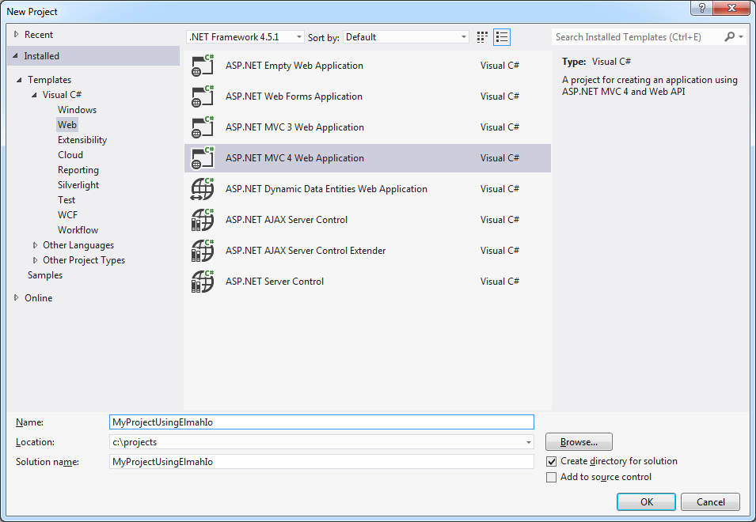

# Logging errors to elmah.io

##### [Thomas Ardal](http://elmah.io/about/), November 11, 2013

> This post has been adapted as part of our official documentation. To read the most updated version, please check out [Logging from ELMAH](http://docs.elmah.io/logging-to-elmah-io-from-elmah/)

This post will explain the steps necessary to log errors from your web application into elmah.io. If you don’t know ELMAH, check out our [ELMAH Tutorial](http://blog.elmah.io/elmah-tutorial/) and visit the nice folks over at the [ELMAH project](https://code.google.com/p/elmah/) page. Let’s get started!!!1

1. Create a new ASP.NET MVC project in Visual Studio (you can choose another web project type if you’d like):



2. Select a project template of your choice:



3. Navigate to elmah.io and login using your favorite social provider. When logged in, elmah.io redirects you to the dashboard. Click on Create new log and name your log:



4. When created, elmah.io shows you the install instructions. Don’t pay too much attention to the install steps, because the rest of this tutorial will guide you through the installation. Copy your log id from step 2 in the installation instructions (located in the dialog):



5. Navigate back to your web project, right click References and select Manage NuGet Packages:



6. In the NuGet dialog, search for elmah.io:



7. Click Install and input your log id in the dialog appearing during installation of the NuGet package:



8. You’re ready to rock and roll. Hit F5 and input a URL you know doesn’t exist (like http://localhost:64987/notfound). You should see the standard 404 message displayed in the browser. To verify that the installation of elmah.io is successful, navigate back to the elmah.io dashboard and select the Search tab of your newly created log:



Seeing the error? Congrats! Every error on your application is now logged to elmah.io.
