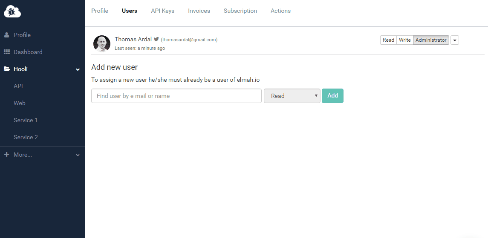

# Managing user access to logs directly on organization settings

##### [Thomas Ardal](http://elmah.io/about/), February 20, 2017

Remember back in July 2016, when we [released Organization Support](https://blog.elmah.io/organization-support/). As promised, introducing organizations on elmah.io, would allow new and improved administrative features. Today we are ready to introduce an improved users administration. While we've supported [assigning a user to multiple logs](https://blog.elmah.io/bulk-managing-users-in-an-organisation/) for months, setting different access levels on individual logs, required admins to navigate between multiple pages.

Check out the improved log access flow directly from the Users tab on organization settings:



Setting individual access levels on different logs or assigning or removing a user to/from all logs, are now available directly from the organization settings view.

Please get back to us with feedback on the new feature or reach out for help.