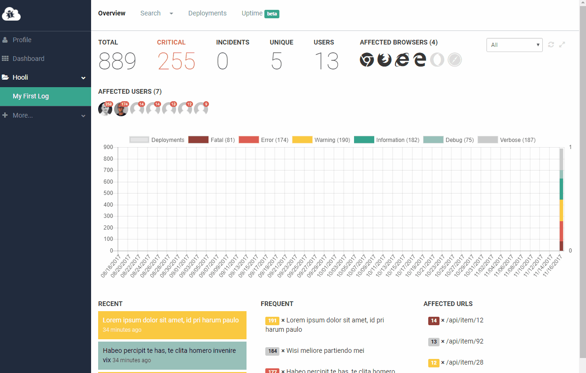
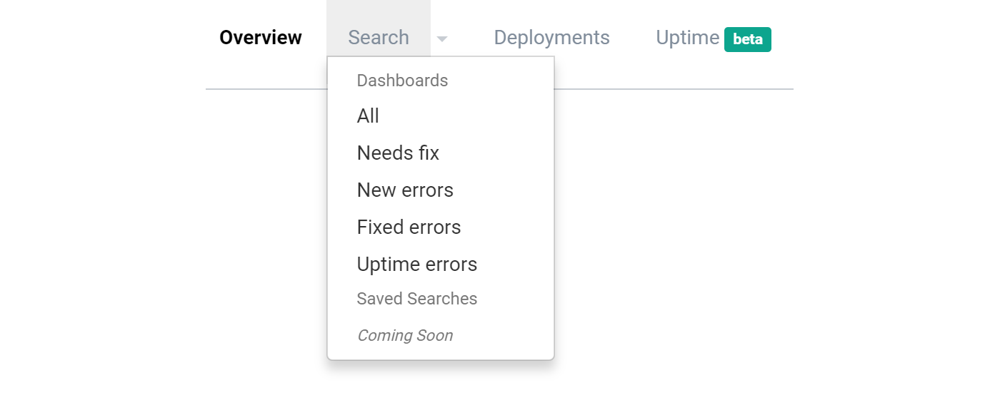
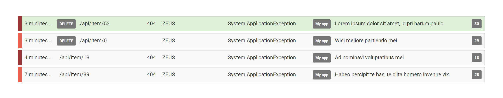

# Mark errors as fixed, dashboards and more

##### [Thomas Ardal](http://elmah.io/about/), November 21, 2017
 
Some of you may have noticed the recent changes on elmah.io already. A week ago, we silently introduced a lightweight issue tracker, right there on the search view. We want to provide you with the tools to do more than just error logging. As part of a successful [.NET error management](https://elmah.io/features/) process, you will need to follow up on errors happening in your applications, as well as making sure that bugs gets fixed and stay that way.

Before going into detail on the changes, I've summed up the changes in the following screencast:

## Dashboards

Dashboards, available from the top menu, is a new feature introduced as part of issue tracking. Dashboards are basically predefined searches, which saves you a lot of key strokes. Currently we have included 5 different dashboards, but plan for more. At some point, you will be able to create and save your own dashboards and share them with your team.

## Issue Tracking

You may already use one of the integrations to [Jira](https://docs.elmah.io/elmah-io-apps-jira/), [YouTrack](https://docs.elmah.io/elmah-io-apps-youtrack/) or [GitHub](https://docs.elmah.io/elmah-io-apps-github/) set up through the [elmah.io app store](https://elmah.io/features/appstore/). But sometimes it makes sense to be able to mark errors as fixed directly on elmah.io. As illustrated on the screencast, marking an error as fixed, is available on the error details by clicking the check mark button.

The benefits of marking errors as fixed are:

1. elmah.io will automatically mark all errors within the same error group as fixed.
2. You will get a much better overview of what to fix.
3. When a fixed errors reoccur, you will get a new notification through email, Slack or whatever notification destination you have configured on elmah.io.

## Updates to the grouping algorithm

Before talking about the updates, let me introduce you to the grouping algorithm (since I haven't really written much about it so far). Being able to group the same error logged multiple times, is an essential part of any error management service. We constantly improve our grouping algorithm, to identify weather or not we've already seen a logged error. The grouping algorithm is used throughout elmah.io to identify new errors, show trend graphs, smart grouping the search result and much more.

With the recent change, we've improved the grouping algorithm as well. Previously, the version number on each message were included as part of the error group. That caused an error to be placed in a new group, every time you would update your software version. While that seemed like a good idea when we introduced it, it caused more problems than it solved really. As the entire industry is moving towards continuous delivery, fixing all known bugs in each release simply isn't possible (or desired since we release small changes often). With the new option to mark errors as fixed, we no longer include the version in the grouping algorithm.