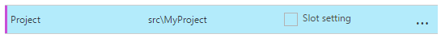

---
description: A compiled list of common questions and answers we've used when troubleshooting Azure Function problems.
booksignup: true
calltoaction: Monitor Azure Functions with elmah.io
---

# Microsoft Azure Functions problems and troubleshooting

##### [Thomas Ardal](http://elmah.io/about/), April 6, 2017

When porting parts of elmah.io to Functions, I've come across a long range of questions and WTF's. This post is a summary of these questions as well as the answered found while sweeping StackOverflow. If you haven't ready our series about Functions, please consider doing that:

- Part 1: [An introduction to Azure Functions and why we migrate](https://blog.elmah.io/migrating-from-windows-services-to-azure-functions/)
- Part 2: [Migrating a Topshelf consumer to a Function running on Azure](https://blog.elmah.io/migrating-a-topshelf-consumer-to-a-function-running-on-azure/)
- Part 3: [Configure and deploy Azure Functions with Kudu](https://blog.elmah.io/configure-and-deploy-azure-functions-with-kudu/)
- Part 4: [Monitoring Azure Functions with the Portal and elmah.io](https://blog.elmah.io/monitoring-azure-functions-with-the-portal-and-elmah-io/)
- Extras: Microsoft Azure Functions problems and troubleshooting

This for some Q and A!

### "Error 0x80070666: Cannot install a product when a newer version is installed" during installation of Visual Studio tooling

To get the tooling working, you will need a custom build of Microsoft Azure App Service Tools, based on the 2.9.6 codebase (available here: [https://blogs.msdn.microsoft.com/webdev/2016/12/01/visual-studio-tools-for-azure-functions/](https://blogs.msdn.microsoft.com/webdev/2016/12/01/visual-studio-tools-for-azure-functions/)). On one of my PC's, I already had App Service Tools 3.0.0 installed, which caused the error above. The solution were to uninstall 3.0.0 and install the custom 2.9.6 build.

### Function templates missing in Visual Studio

Another instance of the error above. In my case, I thought that I had App Service Tools 2.9.6 installed, but in fact I had 3.0.0 installed. Restarting between uninstall of 3.0.0 and install 2.9.6 seemed to do wonders.

### My Function isn't in the root directory, how to configure that?

I like the new structure in ASP.NET Core, with a solution in the root directory and a _src_ folder containing one or more projects. As default, Azure Functions looks for functions in the root only. To configure a sub folder, click the _Configure app settings_ button and add a new app setting named _Project_ with the relative path of the folder containing the `.funproj` file:



Be aware not to specify the full path to the project file, as you'd do when configuring an ASP.NET MVC (and friends) application.

### How do I override Function app settings?

All Functions in a Function App share a set of app settings, located in `appsettings.json`:

```json
{
  ...
  "Values": {
    "AzureWebJobsStorage": "DefaultEndpointsProtocol=...",
    "AzureWebJobsDashboard": "DefaultEndpointsProtocol=...",
    "Connection": "Endpoint=..."
  }
  ...
}
```

The `Values` object maps 1:1 to the values in the app settings section of the Function app settings. To override the `Connection` setting, simply input a new value in app settings:


### How do I access a virtual machine through point-to-site VPN from a Function?

You can secure communications between a web app and a virtual machine using Azure Point-To-Site VPN, as described in my article on MSDN: [Secure Communications Between Azure Web Apps and Virtual Machines](https://blogs.msdn.microsoft.com/mvpawardprogram/2016/03/01/secure-communications-between-azure-web-apps-and-virtual-machines/). If you need the same feature from your function, the only solution I've found so far, is to select _App Service Plan_ in _Hosting Plan_. Running the Function on the App Service Plan (rather than on the Consumption Plan), opens up for _Networking_ settings in the Function app settings view.

### Cannot start multiple Function hosts simultaneously

As default, Azure Functions tools (`func.exe`) starts a process listening on port 7071. When trying to start multiple Function hosts, the process will fail when an existing Function host is already running. To use different ports, use the `--port` setting:

```
func host start --port 7072
```

Something more clever may be build into `func.exe`. Follow this issue for details: [https://github.com/Azure/azure-functions-cli/issues/79](https://github.com/Azure/azure-functions-cli/issues/79)