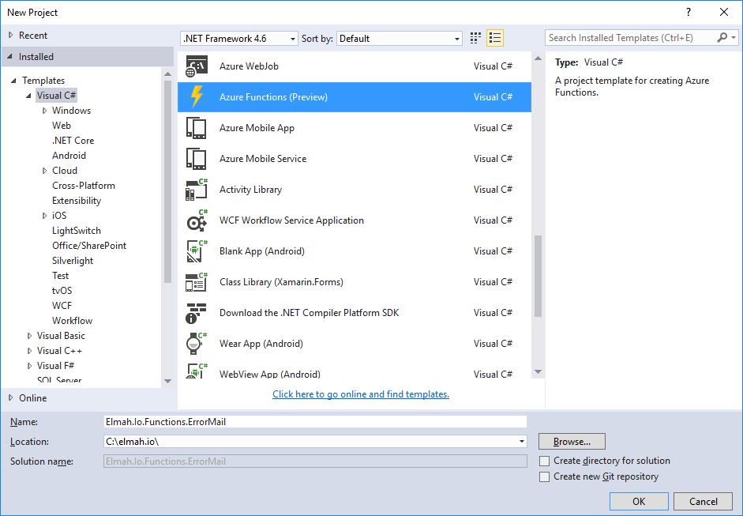
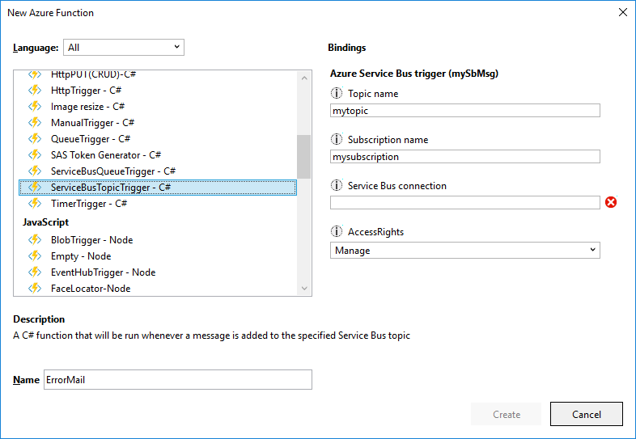
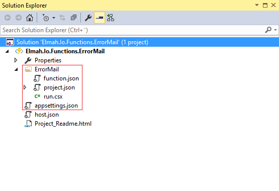
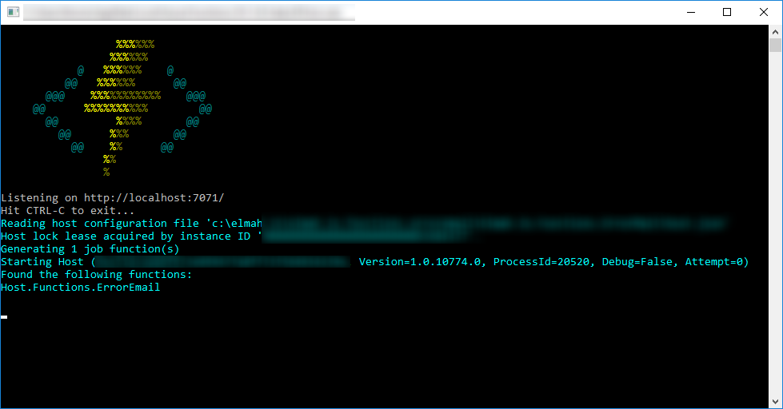

---
description: Show you how to migrate an existing .NET Windows Service reading messages from Service Bus to a Function running on Azure.
image: images/migrate_azure_functions_execute.png
booksignup: true
calltoaction: Monitor Azure Functions with elmah.io
---

# Migrating a Topshelf consumer to a Function running on Azure

##### [Thomas Ardal](http://elmah.io/about/), March 23, 2017

In the previous post, [An introduction to Azure Functions and why we migrate](https://blog.elmah.io/migrating-from-windows-services-to-azure-functions/), I introduced Azure Functions and why we want to migrate parts of elmah.io to Functions. In this post, I'll show you how to migrate a simple Windows Service to Azure Functions. While the example is taken out of the elmah.io source code, the guide is not specific to elmah.io in any way.

A lot of components in elmah.io run asynchronous behind the Azure Service Bus. The first component that I want to migrate, is a Topshelf powered Windows Service responsible for sending the New Error email on elmah.io. I simply love Topshelf for easy Windows Service development, but for reasons detailed in the previous post, I want to utilize the benefits of sending emails "Serverless".

Besides some initialization code (Topshelf, logging etc.), the mail service looks something like this:

```csharp
private void StartListeningForTasks()
{
	var client = SubscriptionClient.CreateFromConnectionString(...);

	while (true)
	{
		BrokeredMessage message = client.Receive(TimeSpan.FromSeconds(5));
	
		if (message == null)
		{
			continue;
		}
	
		var body = message.GetBody<string>();
	
		var sendErrorEmailMessage = JsonConvert.DeserializeObject<SendErrorEmailMessage>(body);
	
		var mandrillApi = new MandrillApi("API_KEY");
	
		Policy
			.Handle<Exception>()
			.WaitAndRetry(3, i => new TimeSpan(0, 0, 0, i * 1))
			.Execute(() =>
			{
				var emailMessage = new EmailMessage
				{
					MergeLanguage = TemplateSyntax.Handlebars,
					Subject = "New error on " + sendErrorEmailMessage.LogName,
					To = new[] { new EmailAddress(sendErrorEmailMessage.Email) }
				};
	
				// Add dynamic variables
				...
	
				var result =
				    await mandrillApi.SendMessageTemplate(new SendMessageTemplateRequest(...));
				
				// Handle result
				...
			});
	}

	message.Complete();
}

```

A quick explanation of what's going on. The method continiously listens for new message using an Azure `SubscriptionClient`. When a new message is received, we deserialize it and handle it. The actual logic around trying to send the email, is wrapped in the wonderful Polly. For more information on how we use Mandrill for sending transactional emails, check out the blog post [Sending transactional emails using Mandrill and .NET](https://blog.elmah.io/sending-transactional-emails-using-mandrill-and-net/).

To move this code to Azure Functions, install [Visual Studio Tools for Azure Functions](https://blogs.msdn.microsoft.com/webdev/2016/12/01/visual-studio-tools-for-azure-functions/) and create a new Azure Functions project:



Right click the new project in Solution Explorer and select Add | New Azure Function. This will take you to the New Azure Function wizard:



Since I want to create a function handling messages on a topic, I've selected ServiceBusTopicTrigger beneath the C# language type. I can reuse all of the configuration regarding the topic from my current Topshelf service. Click Create and the new Function is added. Let's talk about 4 essential files:



The ErrorMail folder contains the files needed for the new Function. `function.json` contains metadata and configuration the the single function. `project.json` pretty much corresponds the project file known from previous versions of ASP.NET Core. We'll edit that in a second. `run.csx` contains the actual code that should be executed when the Function runs. `appsettings.json` contains general configuration that can be re-used across multiple functions.

There's a bug in the tooling for Visual Studio that inserts the connection string in the wrong file. Let's start by fixing that. Rather than having the service bus connection string in `function.json`, we need to move that. Update `project.json` to look like this:

```json  
{
  "disabled": false,
  "bindings": [
    {
      "name": "mySbMsg",
      "type": "serviceBusTrigger",
      "direction": "in",
      "topicName": "mytopic",
      "subscriptionName": "mysubscription",
      "connection": "ConnectionString",
      "accessRights": "Manage"
    }
  ]
}
```

Create a new key beneath `Values` in `appsettings.json` named `connectionString`:

```
{
  ...
  "Values": {
    "AzureWebJobsStorage": "DefaultEndpointsProtocol=https;AccountName=...",
    "AzureWebJobsDashboard": "DefaultEndpointsProtocol=https;AccountName=...",
    "ConnectionString": "Endpoint=sb://..."
  }
}
```

Notice that I've also filled in the `AzureWebJobsStorage` and `AzureWebJobsDashboard` variables with a connection string to a new storage account created on Azure.

Next, I'll move the code from the Topshelf service inside the `run.csx` file:

```csharp
...
using Newtonsoft.Json;
using Mandrill;
using Polly;
...

public static void Run(string mySbMsg, TraceWriter log)
{
	var sendErrorEmailMessage = JsonConvert.DeserializeObject<SendErrorEmailMessage>(mySbMsg);

	var mandrillApi = new MandrillApi("API_KEY");

	Policy
		.Handle<Exception>()
		.WaitAndRetry(3, i => new TimeSpan(0, 0, 0, i * 1))
		.Execute(() =>
		{
			var emailMessage = new EmailMessage
			{
				MergeLanguage = TemplateSyntax.Handlebars,
				Subject = "New error on " + sendErrorEmailMessage.LogName,
				To = new[] { new EmailAddress(emailAddress) }
			};

			// Add dynamic variables
			...
	
			var result =
				await mandrillApi.SendMessageTemplate(new SendMessageTemplateRequest(...));
			
			// Handle result
			...
		});
}

public class SendErrorEmailMessage
{
	...
}
```

The code looks pretty much like before, but without all of the service bus initialization (that I never showed you). Azure Functions handles all of the communication with the topic, completing the message, handling errors etc. Did you notice the file extension? This is actually not C# but C# Script. This means that you no longer need to compile the code and that any error will happen on runtime. You can see this as an advantage or disadvantage, but that's what Microsoft have chosen.

If we would run the Function, it would fail on runtime. The script references some NuGet packages (json.net, Polly etc.). Like ASP.NET Core (when it had a `project.json` file), you can reference NuGet packages in a Function as well:

```json
{
  "frameworks": {
    "net46":{
      "dependencies": {
        "Newtonsoft.Json": "9.0.1",
        "Mandrill": "2.4.181",
        "Polly": "5.0.6"
      }
    }
  }
}
```

The awesome thing about the tooling is, that you can start Function on your own machine. Hit F5 and see magic happen:



In the next post, I will show you how to [deploy the new Function to Azure](configure-and-deploy-azure-functions-with-kudu.md).