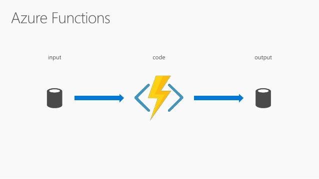

---
description: An introduction to Azure Functions and the rationale behind porting parts of elmah.io from Windows Services to Functions.
image: images/azure-functions.jpg
booksignup: true
---

# Migrating elmah.io from Windows Services to Azure Functions

##### [Thomas Ardal](http://elmah.io/about/), March 20, 2017

As an engineer, I constantly look at new technologies and refactor the elmah.io code base to use new and more productive frameworks and tools. One of the technologies that I have been very excited about lately, is [Azure Functions](https://azure.microsoft.com/en-us/services/functions/) from Microsoft. Functions work much like Lambdas, known from AWS. Small pieces of code that you want to execute at a specific point in time, when an event happens and more. Functions grew into general availability late last year, but I don't believe that they have been production ready until now.



Functions are often referred to as Serverless Computing. As Scott Hanselman so perfectly explain it in his [blog post](https://www.hanselman.com/blog/WhatIsServerlessComputingExploringAzureFunctions.aspx):

> "Serverless Computing" doesn't really mean there's no server. Serverless means there's no server you need to worry about.
> 
> &mdash; *Scott Hanselman*

With Functions there are no virtual machine to maintain, no security updates to install etc. Azure allocate CPU for a function when it needs to run and de-allocates the CPU when done. A huge benefit of this approach is, that you only pay for the CPU cycles you use and not for one or more virtual machines sometimes doing a lot and sometimes doing nothing. Another benefit of using Serverless Computing is, that Azure are able to scale execution of the functions to the current need. Having a lot of messages on Service Bus? No problem. Azure just distribute the messages to more machines.

In this week, I finally took the first step towards migrating parts of elmah.io to Functions. As you may know, we are hosting everything on Microsoft Azure and use a lot of the features available. As explained in the post [Building a scalable architecture to handle millions of errors](https://blog.elmah.io/building-a-salable-architecture-to-handle-millions-of-errors/), we use Azure Service Bus for a lot of features. All messages sent by our users are processed asynchronous using Service Bus. Mails are sent through the service bus. The integrations with Slack, HipChat etc. are implemented using the Service Bus. While I love this part, having Windows Services on a virtual machine doesn't exactly yell *Cloud* or *Scale* and it's something that I've always wanted to change. The main problem with this deployment model is, that we need to monitor the current load on our queues, and manually spin up new consumers when needed. Don't get me wrong, we constantly monitor elmah.io. But having to scale anything manually, should be history when using the Cloud.

This post was pretty much a sum up about the possibilities with Functions and why we needed something smarter to scale elmah.io. In the next post, I will dig down into some code. I'll show you how I migrated one of our Service Bus consumers from a Windows Service powered by Topshelf to an Azure Function. Until next time.