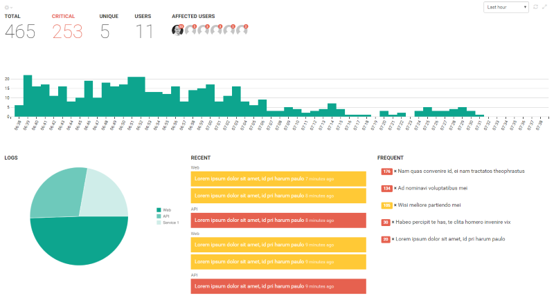
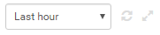
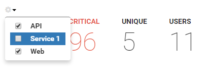
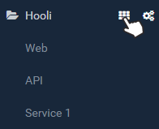

---
description: The organization overview gives the perfect overview of all your logs. Monitor when new errors are logged and how they distribute across your different logs.
image: images/orgoverview.png
---

# Monitoring all logs with the new organization overview

##### [Thomas Ardal](http://elmah.io/about/), February 16, 2017

elmah.io provides a set of great dashboards for monitoring your logs. The log overview gives you a quick overview of the activity on a specific log. The log search makes it possible to dig into the details of the errors happening on your site. Finally, the main dashboard provides a list of all logs and a graph showing the activity on each log as a simple sparkline.

Se what's missing? You're right! An overview containing data from multiple logs. Say hello to the new organization overview:



The organization overview merge results from all of your logs and present it as a manageable dashboard much like the log overview. The widgets in the top show a number of overall metrics, like how many critical errors where logged. The graph below show how errors distribute over time. Finally, three widgets are shown in the bottom. You already know the recent and frequent lists from the log overview. In this dashboard, errors from multiple logs are correlated into the lists. The Logs widget show how errors distribute across logs.

The new organization overview is the perfect place to go, when you want to put something on a big screen as well. Much like the log overview, you can configure both the time period, enable auto refresh and switch into full screen mode, using the dropdown and the icons in the top right corner:



Sometimes you may not want to show data from all logs. If you have different logs for your staging and production environments ([which we recommend](https://docs.elmah.io/use-multiple-logs-for-different-environments/)), you can include/exclude logs, by clicking on the small gear icon in the top left corner:



To get to the organization overview, hover the organization name in the left menu and click the dashboard icon:



As always, please reach out if you have ideas for improvements, find bugs etc. We love to chat with our users.