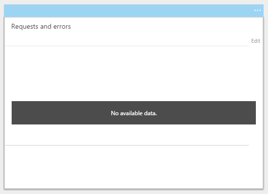
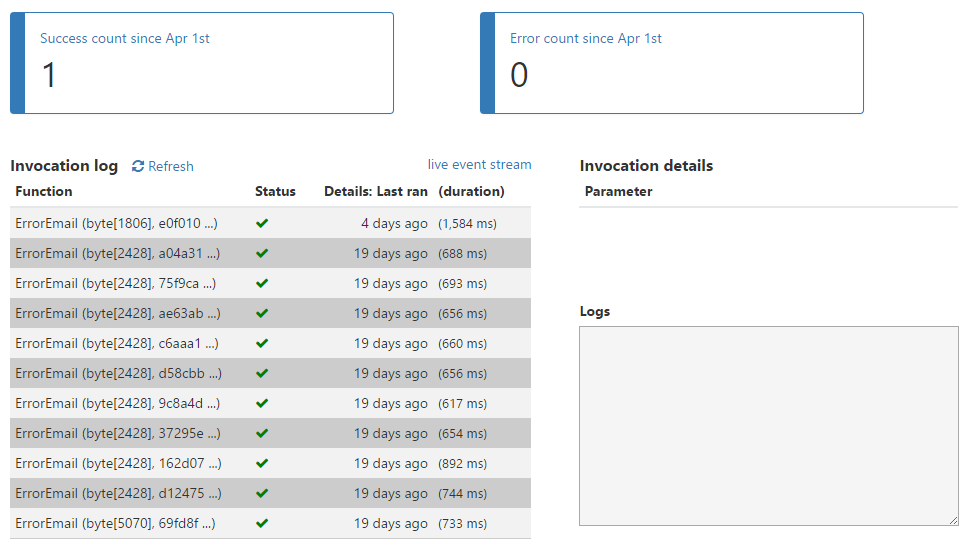
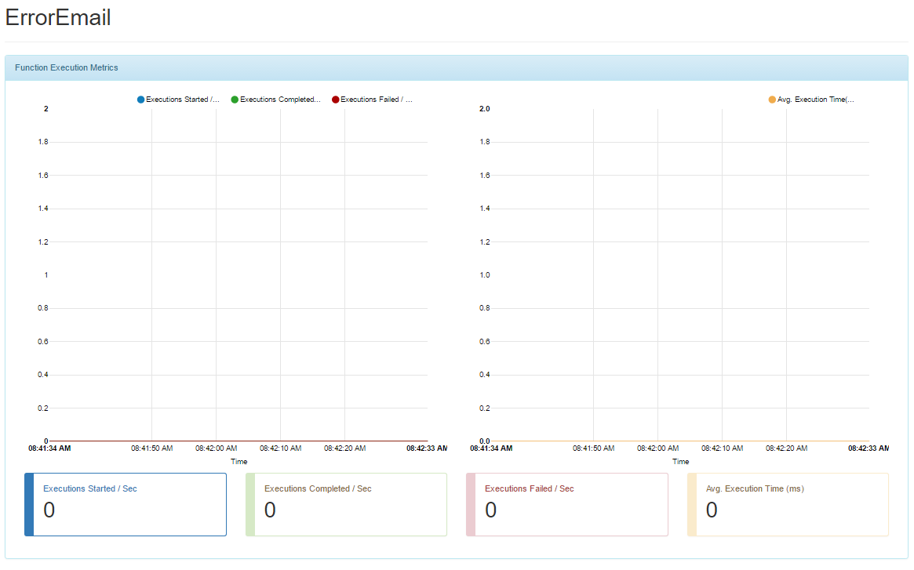
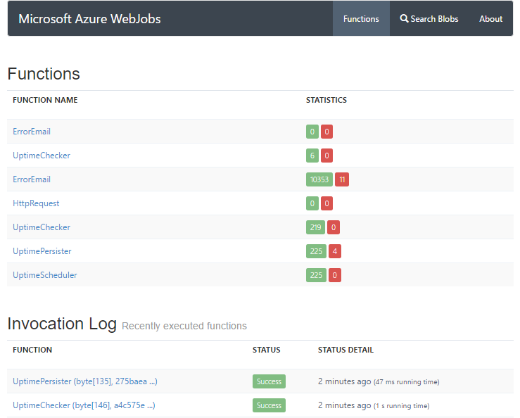
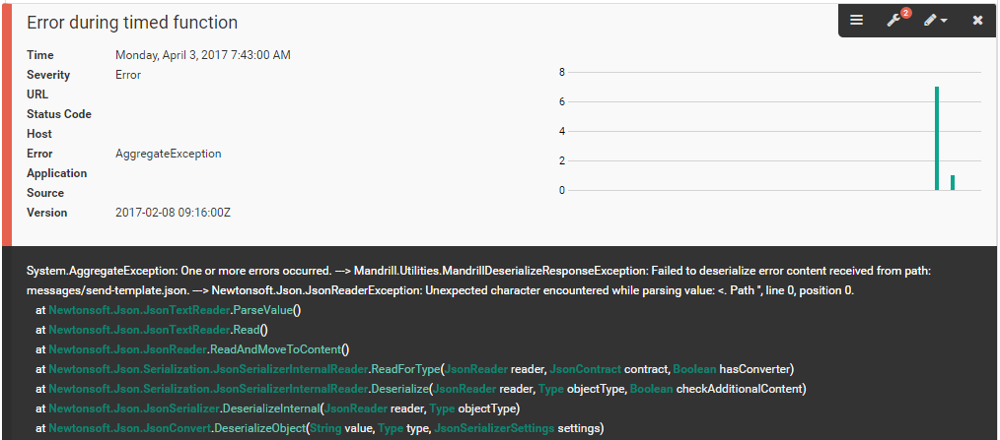

---
description: A guide to monitoring execution of Azure Functions, using the built-in tools provided by Microsoft. As a better alternative, you can use the power of elmah.io.
image: images/function_error_elmahio.png
booksignup: true
calltoaction: Monitor Azure Functions with elmah.io
---

# Monitoring Azure Functions with the Portal and elmah.io

##### [Thomas Ardal](http://elmah.io/about/), April 6, 2017

The final post (so far) about Azure Functions, is also the most important. If you haven't already read the other posts in the series, they are here:

- Part 1: [An introduction to Azure Functions and why we migrate](https://blog.elmah.io/migrating-from-windows-services-to-azure-functions/)
- Part 2: [Migrating a Topshelf consumer to a Function running on Azure](https://blog.elmah.io/migrating-a-topshelf-consumer-to-a-function-running-on-azure/)
- Part 3: [Configure and deploy Azure Functions with Kudu](https://blog.elmah.io/configure-and-deploy-azure-functions-with-kudu/)
- Part 4: Monitoring Azure Functions with the Portal and elmah.io

In the last post, I showed you how to implement continuous deployment of your Function using the deployment engine built into Kudu. With the Function in production, the next question is: how do I monitor if my Function works or not. Glad you asked. Let me show you.

## Monitoring Functions with features built into Azure

While the execution engine behind Functions seems stable enough to use in production, the built-in monitoring still lacks some essential features. When running on the consumption plan, the monitoring widget on the app service view is empty:



If you click Monitor on a Function, there's an invocation log that doesn't seem to update regularly:



See the link _live event strem_? If you click that, a nice dashboard with live updates from the Function should appear. While I have succeeded in getting the graph generated from time to time, it mostly shows an empty page or this:



To quote The Dude <q>That's a bummer, man!</q>. None of the obvious choices actually work (as of April 6, 2017). The only working solutions, seems to be using Kudu and the command line tools. To tail the Function log file, execute the following PowerShell (similar command available for the Azure CLI):

```powershell
Get-AzureWebsiteLog -Name "elmahiofunctionsemail.azurewebsites.net" -Tail
```

The window now tail the Function log file and it actually works:

```cmd
2017-04-03T06:21:34  Welcome, you are now connected to log-streaming service.
2017-04-03T06:35:08.325 Function started (Id=...)
...
```

To monitor functions, click _Function app settings_ | _Go to Kudu_. In the new window, click _Tools_ | _WebJobs Dashboard_ | _Functions_:



Monitoring a production system by refreshing a webpage or looking at a PowerShell window isn't exactly ideal. Let me show you how we've chosen to monitor our Functions (using elmah.io of course).

## Monitoring Functions with elmah.io

What we really want is a way to monitor if Functions starts failing. Luckily, elmah.io is created for error management, why it should be a good choice for monitoring Functions as well. Let's extend the code from the previous posts with some error logging:

```csharp
...
using Elmah.Io.Client;
using Elmah.Io.Client.Models;
...

public static void Run(string mySbMsg, TraceWriter log)
{
	...
	var apiKey = ConfigurationManager.AppSettings["apiKey"];
	var logId = new Guid(ConfigurationManager.AppSettings["logId"]);
	var elmahioApi = ElmahioAPI.Create(apiKey);

	try
	{
		...
		var result =
			await mandrillApi.SendMessageTemplate(new SendMessageTemplateRequest(...));
	}
	catch (Exception e)
	{
		elmahioApi.Messages.Error(logId, e, "Error during timed function");
		throw;
	}
}
```

I've left out most of the boilerplate code to focus on the important parts. Before handling the message, I create a client for communicating with the elmah.io API. In this example, I use the raw [Elmah.Io.Client](https://www.nuget.org/packages/Elmah.Io.Client/3.0.41-pre) package from NuGet, but using something like Serilog or log4net, would be possible using a similar approach.

To catch any exceptions during Function execution, I wrap the code in a try-catch block. If an exception occur, I log it using the elmah.io client previously created.

To make this code work at runtime, I need to add the Elmah.Io.Client NuGet package to `project.json`:

```json
{
  "frameworks": {
    "net46":{
      "dependencies": {
        ...
        "Elmah.Io.Client":  "3.0.41-pre" 
      }
    }
  }
}
```

Finally, I need to specify the `apiKey` and `logId` values in `appsettings.json`:

```json
{
  ...
  "Values": {
    ...
    "apiKey": "MY_API_KEY",
    "logId": "MY_LOG_ID"
  }
}
```

That's it! When a Function fails, the exception is automatically stored on elmah.io:



Unlike the features available on Azure, I now have the choice to get notifications on mail, Slack, etc., search errors happening in Functions and much more.