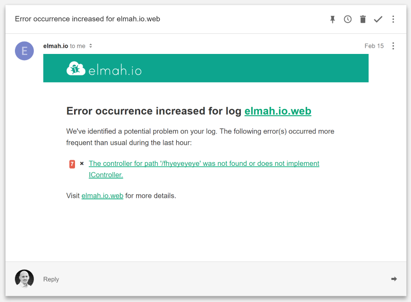

---
description: The Error Occurrence Increased Email notifies you when one or more errors happen more frequently than usual.
image: images/erroroccurencemail.png
---

# New error occurrence email highlights repeating errors

##### [Thomas Ardal](http://elmah.io/about/), February ?, 2017

New features are tumbling out of the elmah.io factory these days. X days ago, we released the new [organization overview](https://blog.elmah.io/monitoring-all-logs-with-the-new-overview/). Today we are ready to show you a new mail that we have been running in closed beta for some time. Please welcome the Error Occurrence Increased Email.

While we may not win any awards for naming things ("Error Occurrence Increased Email", really?), we think that you will love the new mail. We currently offer an email when new errors are observed, as well as a daily digest of last days activity. But why wait 24 hours to react, when the severity of an error suddenly increases?

Here's an example of the new mail:



In the example above, an ASP.NET MVC error on our website happened 7 times within the last hour. The cool thing about the new email is, that you are only notified when an error happens more frequently than usual. If the same error happens 7 time every hour, you don't want emails constantly reminding you to fix this. That's what issue trackers are for, eh?

Combining the New Error Email, the Daily Digest Email and the Error Occurrence Increased Email helps you keep an active eye on your error logs from within your inbox.

As usual, subscribing to emails is done when creating new logs or on your [profile](https://elmah.io/profile#emails).