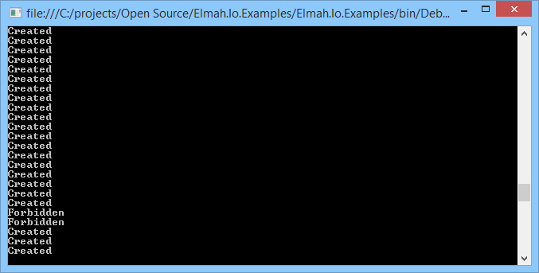

# New Feature: Burst Protection

##### [Thomas Ardal](http://elmah.io/about/), May 26, 2014

## We just pushed a new features to all you guys and gals: Burst Protection.

I’m not saying that it ever happened to you, but you probably know someone, who knows someone, who’s cousin knows someone … well you get it. You released a new version of your software to production and suddenly everything starts failing. All of your users are frustrated and your operations team run around like headless chickens. When stuff like this is happening, your website typically logs a lot of errors. Depending on which [elmah.io plan](https://elmah.io/pricing/) you’ve purchased, you have a maximum number of allowed errors. Even though this number is a soft limit, we cannot guarantee that we store everything if you start logging thousands and thousands of errors within a short period of time. Burst Protection to the rescue!

With Burst Protection we make an intelligent decision, when your site suddenly starts pushing a shit load of errors to elmah.io. This means that only a percentage of the errors are actually logged. This makes it easier for you to keep within the quota and also make easier for you to track down the actual errors.

So how does elmah.io respond when under pressure? Let’s write a little evil piece of code:

```csharp
for (var i = 0; i < 500; i++)
{
    Task.Factory.StartNew(() =>
    {
        var request = (HttpWebRequest)WebRequest.Create("https://elmah.io/api/errors?logid=dbba9674-6fbf-4ebe-ada9-0c74dc77cda5");
        request.Method = "POST";
        request.ContentType = "application/x-www-form-urlencoded";
        var elmahError = new Error(new ApplicationException());
        var errorString = ErrorXml.EncodeString(elmahError);
        var errorStringEncoded = HttpUtility.UrlEncode(errorString);
        var bytes = Encoding.UTF8.GetBytes("=" + errorStringEncoded);
        request.ContentLength = bytes.Length;
        var outputStream = request.GetRequestStream();
        outputStream.Write(bytes, 0, bytes.Length);
 
        HttpWebResponse response;
        try
        {
            response = (HttpWebResponse)request.GetResponse();
        }
        catch (WebException e)
        {
            response = (HttpWebResponse) e.Response;
        }
 
        Console.WriteLine(response.StatusCode);
    });
}
```

The short version: Perform 500 requests to the [elmah.io API](https://elmah.io/api/) within a short period of time. HTTPS request example is taken from our [elmah.io usage examples](https://github.com/elmahio/Elmah.Io.Examples). Here’s a screenshot of the output after a few hundred errors logged:



As you can see, elmah.io starts returning a different status code for some of the errors. If you’re using the [elmah.io NuGet package](https://www.nuget.org/packages/elmah.io/) for your web application, you won’t even notice the different status code, because this is handled within the client.


