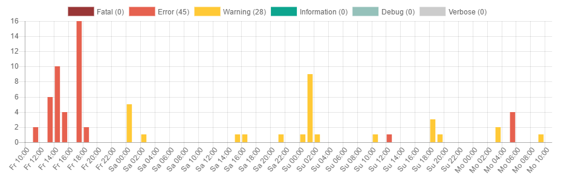
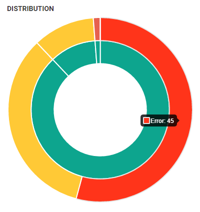
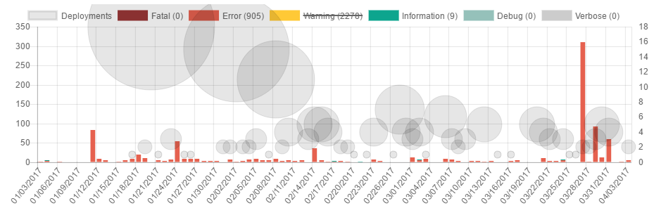

---
description: Using Chart.js, we have improved existing graphs as well as created entirely new visualization on the various dashboards on elmah.io
image: images/deployment_tracking_on_overview.png
---

# New features and improvements using a new chart control

##### [Thomas Ardal](http://elmah.io/about/), April 4, 2017

Time for an update of new features and improvements on elmah.io. As some of you already noticed, we have started switching to a new graph control. We previously rendered all graphs using D3.js, which were the new best thing back when we launched. While D3 is definitely cool and offers some nice features, using a specialized graph control, makes it a lot easier for us to extend graphing and build new cool features. After looking at a range of different options, we settled with Chart.js.

We've already released a lot of improvements using Chart.js. The redesigned timeline on the Log Overview, now shows messages per hour/day, grouped by severity:



Grouping messages by severity, gives a much better overview of the messages generated. Severities can be toggled by clicking on the legend.

Chart.js also lets us build multiple level graphs, like the redesigned error distribution doughnut on Organization Overview:



The inner circle shows logs generating errors during the chosen interval. The outer circle show the distribution of warnings, errors and fatals on each log, giving you a much better overview of which logs to monitor closely within your organization.

For our users with the [Deployment Tracking add-on](https://elmah.io/features/deploymenttracking/), deployments are now shown directly on each Log Overview:



The bubbles show the number of deployments made, which highlights if one or more deployments caused a spike in errors.

We hope that you will get an even better overview of your logs, using the new and redesigned graphs. We will continue to replace and improve the remaining graphs over the next couple of weeks. If you have feedback regarding the new graphs or anything else, please get in touch through the support widget.