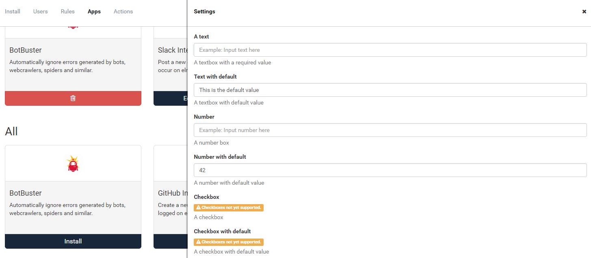

# New Features for App Store Developers

##### [Thomas Ardal](http://elmah.io/about/), September 5, 2016

If you are among our Business or Enterprise users, you probably know the [elmah.io App Store](https://elmah.io/features/appstore). If not, we'll start with a short introduction. The elmah.io App Store provide a range of extensions for integrating elmah.io into various work flows. Want to ignore errors generated by bots? You install the BotBuster app. Want to send a notification to Slack on new errors? You install the Slack app etc. The App Store works a lot like the [Rules](http://docs.elmah.io/creating-rules-to-perform-actions-on-messages/) feature, but everything is point and click. In fact, most apps are build on top of rules.

What you may not know is that app development is available for everyone. If you want to read more about developing apps, please read through [Creating Apps for elmah.io](http://docs.elmah.io/creating-apps-for-elmah-io/). Creating an app is as simple as writing a bit of JSON and publishing it on NuGet.

We recently released some new features for app developers. Previously, only simple settings using string-based key/value pairs were supported. With the recent additions, app developers have more control on how to configure an app. To show you the possibilities with the new app manifest, we've also created the [Playground app](https://github.com/elmahio/elmah.io.apps.playground), which showcase the various setting types:



For now, strings, numbers and dropdowns are supported, but additional types will be added in the near future. Default values are supported as well, making it super simple to install new apps with a set of already known values.

At the time of writing this post, 8 apps are available in the App Store. We would love to see more community driven apps. Reach out if you need help developing a new app. We want to support the work flows that our users actually need, rather than having 1.000 integrations that nobody uses.