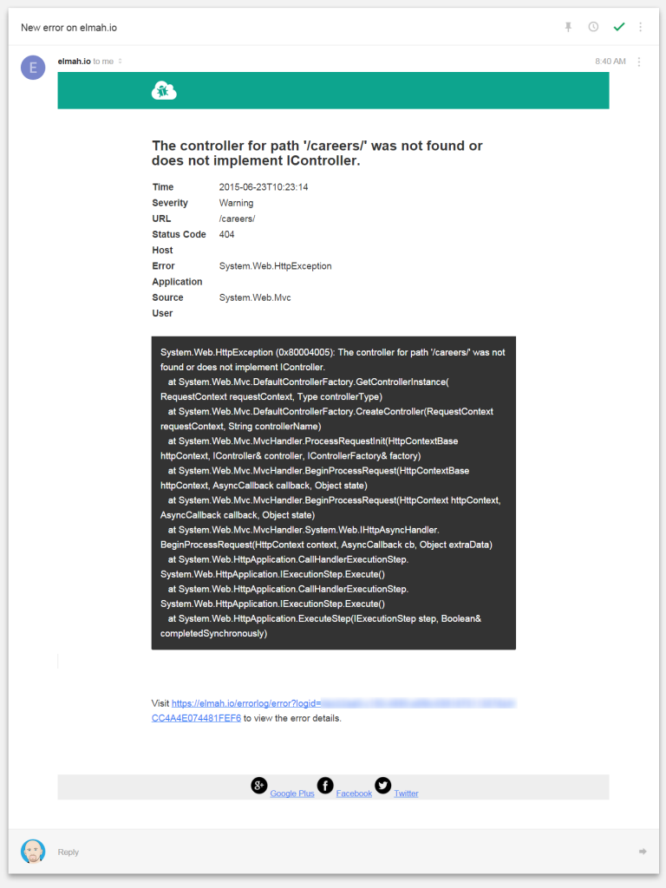

# New mail template

##### [Thomas Ardal](http://elmah.io/about/), June 23, 2015 in [Tutorials](/category/tutorials/)

A feature request that we’ve received a lot, is to improve the mail template when logging new messages to elmah.io.

You may not know it, but elmah.io supports mail communications through the Business Rules feature available on your log settings. In the past, the emails contained the message title and a link only, which would force you to login to elmah.io to watch the details about a logged message.

With the new and improved mail template, you will be able to inspect almost all of the details about a logged message directly in your inbox. Save time by avoiding to login to elmah.io every time a new message appear in your log.

Let’s look at an example:



The message title is shown as the heading. The table below shows the various pieces of information also shown on elmah.io. The box with the dark grey background contains the details of the message in this example the stacktrace of the logged error. In the bottom there’s link to the error details page on elmah.io.

We hope that the improved template will save you tons of time.
