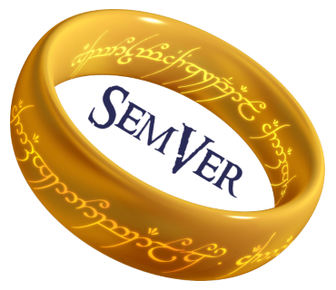

# One versioning scheme to rule them all

##### [Thomas Ardal](http://elmah.io/about/), February 2, 2017

We are in the process of building new prereleases of all of the elmah.io client integrations, based on our [v3 API](https://api.elmah.io/swagger/ui/index). While doing so, we are also introducing a new versioning scheme. For an overview of all of our client packages, check out [The elmah.io NuGet package landscape](the-elmah-io-nuget-package-landscape.md) post.

It's no secret, that we are fans of [SemVer](http://semver.org/) at elmah.io. Having a standard for naming software as well as indicating breaking changes is essential in modern software development. While we have used SemVer to version our client libraries from day 1, we haven't been consistent. That have caused some problems out there, making it hard to understand which versions of `Elmah.Io.Client` and the API to use. That's about to change.

From the new prereleases and going forward, the major version of our client libraries follow the API version (currently in version 3). This means that `Elmah.Io.Client` version `3.0.42` uses API v3. Same goes for the packages for ELMAH, log4net etc. The `elmah.io` package in version `3.0.21` uses `Elmah.Io.Client` in version `3.*.*`. As specified in SemVer, different versions inside the same major version, will be backwards compatible.

We've bumped all of our packages previously named `1.x.x` to `3.0.x`. The packages will continue to be released and versioned individually for obvious reasons.

As a final note, we have a couple of integrations where we are not in the control of the version number (like the target for Logary). These packages will continue to follow the versioning number schemes defined by the individual projects.