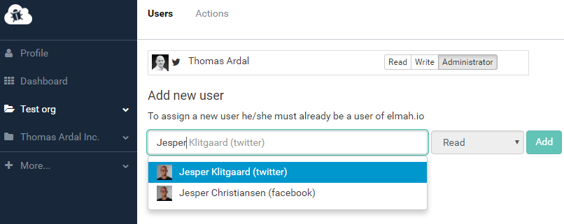

# Organization Support

##### [Thomas Ardal](http://elmah.io/about/), July 4, 2016

We are happy to report, that the heavily requested and much anticipated Organization support has been released. With this new feature, everyone inside your organization will be able to create logs. All users have been migrated into one or more auto-generated organizations. If you are the administrator of your company, you will probably want to rename the organization to something meaningful. This can be done directly from the dashboard.

Unlike previous, user administration is no longer available on each log. When needing to add new users, navigate to the new organization settings view and add/remove users from the list:



All users within an organization, is available in the Users tab on each log settings. We have automatically migrated all users on your logs to the new organization, but you may want to run through the list to make sure that everyone is awarded the correct role. Making a user Administrator, will allow them to create new logs inside your organization.

So what’s next? The organization feature is still pretty limited and we want to extend it heavily in the near future. Moving the subscription from your user to the organization is high on our list. Also auto-assigning users to logs when added to the organization is something that we want to implement. For now, we would love your input, when you start playing with the new feature.

We really hope that you will like the new organization feature as much as we have loved building it.