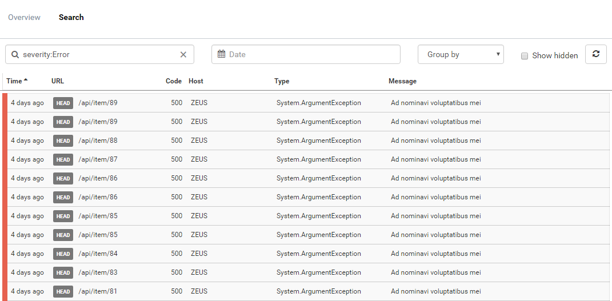

# Permanent link to search results

##### [Thomas Ardal](http://elmah.io/about/), August 22, 2016

Some times, it's the small changes that makes the big difference. Today we introduce what looks like a minor change, but in fact opens up for a range of new possibilities on elmah.io.

Remember the search page? Let's recap:



In the example, I've filtered the view by a query (`severity:Error`), showing messages with the `Error` severity only. This seems like a pretty important view to visit again and again. Previously, you would have to input this query every time you visited elmah.io. As of today, the query (as well of other choices on that page) is part of the URL:

`https://elmah.io/...&freeText=severity%3AError&hidden=false&groupBy=&sort=time&order=asc#searchTab`

The actual URL isn't really the interesting part here. But having the query parameters, sort order etc. present in the URL, makes it easy to bookmark a specific search and/or search result. Send e range of errors to your colleagues on mail. Create a new issue in your favourite issue tracker with a search result from elmah.io. The possibilities are endless.

For now, we've started using the permalink feature internally on elmah.io to allow easy navigation between pages. In the future, external integrations will support this feature as well. Both the [Daily Digest](/daily-digest-email) email and [elmah.io Visual Studio extension](https://visualstudiogallery.msdn.microsoft.com/369827de-80ca-4b36-9b73-88bd85fdbc81) seems like obvious choices to improve from this.