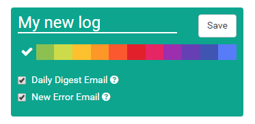
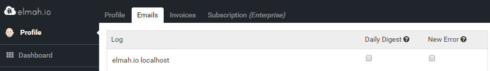

# Receive an email when a new error is logged

We try to do anything in our power to make visiting elmah.io a pleasant experience. But visiting elmah.io on a daily or even hourly basis to spot new errors quickly becomes tedious. That’s why we’ve implemented the New Error Email.

Sending emails from elmah.io have been implemented since [last year](http://blog.elmah.io/elmah-io-20140315-released/), but it’s an all or nothing solution. This means that you’d get a new email every time an error were logged. Consider introducing a bug on your website logging the same error thousands of times. Moments later your inbox will be stuffed with thousands of error emails.

To improve this scenario you now have the option of enabling the New Error Email when creating a new log:



We’ve used the opportunity to add an option to subscribe to the [Daily Digest Email](http://blog.elmah.io/daily-digest-email/) as well.

The New Error Email uses the same mail template as we’ve [written about in the past](http://blog.elmah.io/new-mail-template/), but unlike previously you only get an email when a new error is logged. It’s difficult to distinguish whether an error is new or not, but for now a new error is defined as: an error title and severity that we haven’t seen within the last 24 hours. If you have input to this algorithm, please get in [contact](https://elmah.io/about/).

Multiple users have the opportunity to subscribe to the New Error Email (like the Daily Digest Email). When enabling the checkbox during creation, you will automatically receive the emails. Collaborators on your log will be able to enable both emails on their [Profile page](https://elmah.io/profile/#emails):



This is also the place to go if you want to enable/disable emails for existing logs.

Finally we would like to encourage you to switch to the new email feature if you’ve already set up emails beneath the Rules tab on the log settings. We wont remove this feature, but sending thousands and thousands of emails to the same email address is something that we eventually won’t support.
