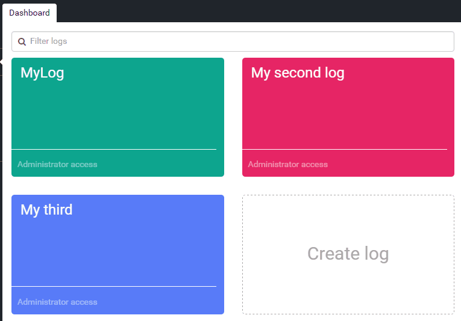

# Redesigned Dashboard with Drag and Drop

##### [Thomas Ardal](http://elmah.io/about/), April 14, 2016

The Dashboard, probably the first elmah.io page you saw after sign up. What we've tried to do in the Dashboard, is to show you an overall view of your logs. Thanks to you, the users, the dashboard have improved over time with both shortcut buttons, inline editing and custom colouring. With the latest bunch of improvements, the Dashboard have become even better.

We've received a lot of requests for ordering logs on the dashboard. While the custom colours gives some nice possibilities, being able to place related logs next to each other, means everything when having a lot of applications. That's why we've implemented just that using drag and drop:



Another request that we have heard from time to time, is the option to cancel editing a log. With the new log editor, there's a close button and we made it more visible which log you are editing, using a nice animation effect:



We hope that you will love the redesigned Dashboard as much as we have loved build it. As usual, ship off your comments on this post, [Twitter](https://twitter.com/elmah_io), [Facebook](https://www.facebook.com/elmahdotio/) or [Google+](https://plus.google.com/+ElmahIoPlus/posts).