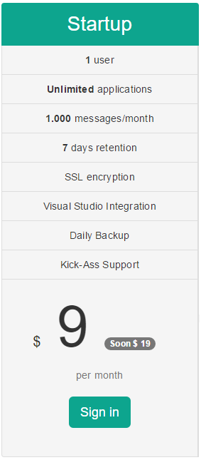

# Restructuring Plans and Pricing

##### [Thomas Ardal](http://elmah.io/about/), September ?, 2016

We constantly reconsider and adjust our plans and pricing offerings. When developing new features, we need to consider which plans to put the new feature into (if not all). When competitors adjust their terms, we need to verify that we can still compete with that etc. That's pretty much the situation for every company.

During our 3 years of existence, elmah.io plan offerings have been dynamic. We started with the Personal, Business and Enterprise plans. Two years ago we [introduced Small Business](http://blog.elmah.io/introducing-the-small-business-plan/). Last year we removed the Personal plan, since pretty much all of our users are companies anyway. One thing that we didn't change though, is the pricing of the various plans. Since purchasing your subscription, a lot of new features where added free of charge to all plans. This year we've implemented [Logary support](http://blog.elmah.io/support-for-logary/), [organizations](http://blog.elmah.io/organization-support/), [App Store](http://blog.elmah.io/elmah-io-appstore/), the [User Agent view](http://blog.elmah.io/improvement-seven-user-agent-view/) and [much more](http://blog.elmah.io/) without extra charge.

The feedback we've received after removing Personal is, that some of our users actually like a very small plan for a single user only. That's why we re-introduce the Personal plan but now branded against startups. This plan is perfect for you guys just starting up your business. You may only be a single founder or at least only a single user needs access to Error Management using elmah.io.



For now the price of the Startup plan will be $9 per month, but we will soon bump that to $19 per month. We believe that the benefits you will receive with a elmah.io Startup plan greatly exceeds $19. In the same round of adjustments, we will increase the price of the Small Business plan from $19 to $29 per month. The Small Business plan is ideal when you've gained traction in your startup or for smaller companies with only a few people needing to access Error Management. Keep an eye on the blog for information about new features coming to the Small Business plan.

To make sure to get a Startup plan for $9 per month or a Small Business plan for $19 per month, you should purchase now. We will adjust the prices within the next couple of months for new customers. Existing customer? No worries, you will continue on your current plan going forward.