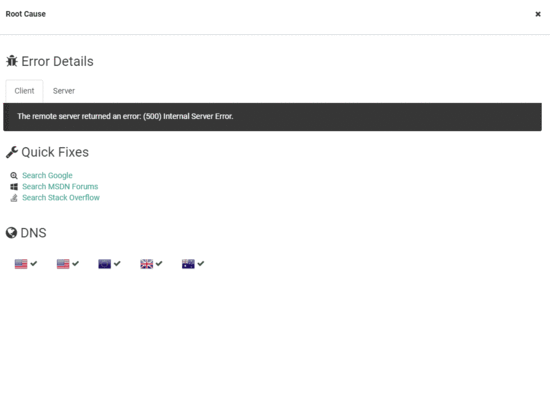

---
description: With Root Cause Analysis, you get a particular set of skills. By combining the client and server perspective, fixing uptime errors have never been faster.
image: images/root-cause.gif
calltoaction: Uptime Monitoring with elmah.io
---

# Root cause analysis to the rescue

##### [Thomas Ardal](http://elmah.io/about/), November 7, 2017

We recently introduced the new Root Cause feature on uptime monitoring. While the existing error details view available on elmah.io is great for looking at server-side errors, the new view is optimized to help you fix uptime errors. Since uptime errors are logged in your existing error logs, the error details for this type of error now show an alternative view:



The root cause view shows a list of details of each uptime error. In the top, the error details as seen from both the client and server are shown. Having both the client and server perspective is something that we believe will save you a lot of time investigating errors. In the end, you want a failing site up and running as quickly as possible, right?

Below, quick fixes known from errors logged by your application are shown. We are currently implementing a set of fixes specifically for uptime errors. A fix to identify and renew an expired SSL certificate seems obvious. We would love your input to additional rules.

In the bottom of the root cause view, you will be able to see if there's a problem with DNS in one or more regions. When clicking each region, you will see additional information about how the hostname of your uptime check resolves and performs.

If you are not already using elmah.io Uptime Monitoring, you are missing out. It may still be in beta, but it's running stable and new features are constantly added. For more details, check out [Uptime Monitoring .NET web applications](https://elmah.io/features#uptimemonitoring).