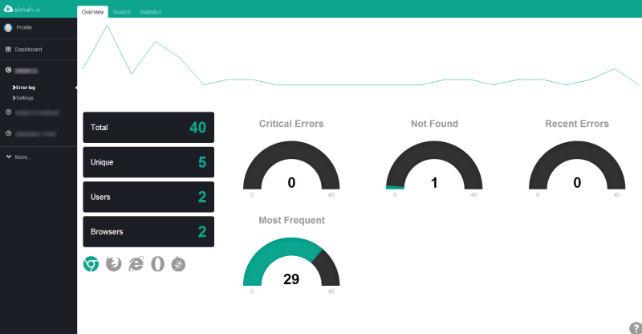
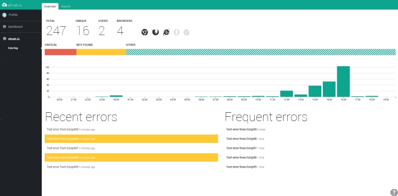

# Say hello to the redesigned Overview

##### [Thomas Ardal](http://elmah.io/about/), July 30, 2014

## Back in April we [launched the Log Overview](https://blog.elmah.io/elmah-io-20140412-released/) – a new tab which gave you a chance to get an overview of your log activity within the last 24 hours. Today we’ve launched a new and redesigned Log Overview.

Since launching the Log Overview, we have used the new tab to monitor elmah.io itself. Furthermore a lot of you have send ideas and suggestions for changes through our support system. We ended up using most of the ideas from you guys, to build a new and improved Log Overview. But first, let’s look at the old Overview:



To sum up, what we mostly heard was:

1. The sparkline chart on the top doesn’t really show anything but the development of errors.
1. The black boxes containing summarized counts of various metrics are great, but they are too dominant and it would be great with an explanation on each counter.
1. The critical and not found gauges are nice, but takes up too much space.
1. No-one understood the content of the Recent and Most Frequent errors.
1. Some of you suggested a summary of recent errors. Others wanted to see the most frequest error.

With that in mind, check out the redesigned Overview:



So what changed?

1. The summarized boxes have moved to the top and now show an explanation when hovering each metric.
1. The gauges have been replaced by a bar chart, showing errors grouped by “Critical”, “Not Found” and “Other”.
1. The sparkline in the top have been replaced by the bar chart from the Statistics tab (now located in the middle). BTW this chart where the only remaining element on Statistics, why this tab is now removed.
1. In the bottom left, there’s a list of the 5 most recent errors. The background color indicates the severity of each error. The bottom right contain a list of the most frequent errors.
1. Almost everything on the overview is clickable. When clicking various metrics, you are redirected to the search tab, showing you errors matching the clicked metric.

We hope that you’ll enjoy the new Overview as much as we’ve enjoyed building it :)


