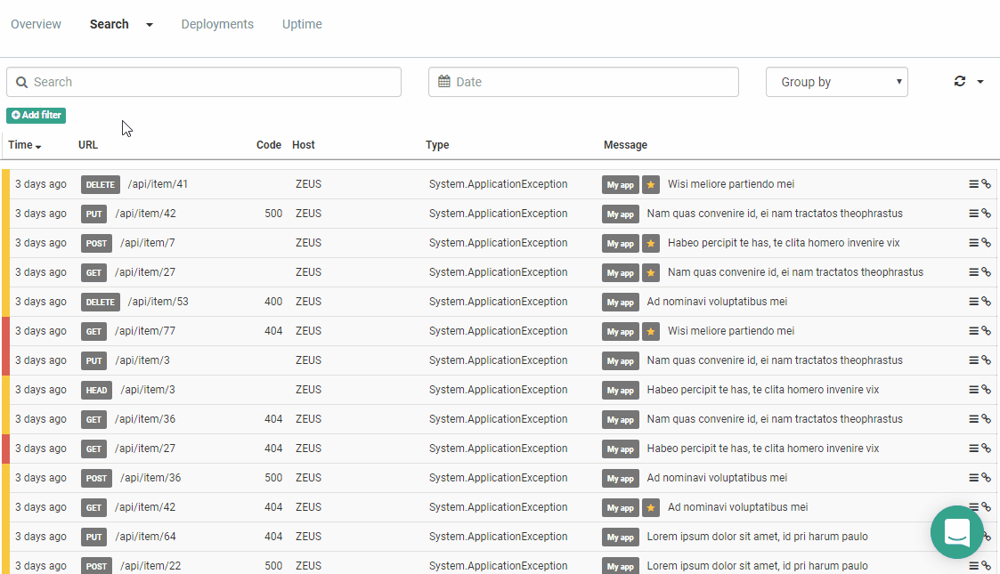
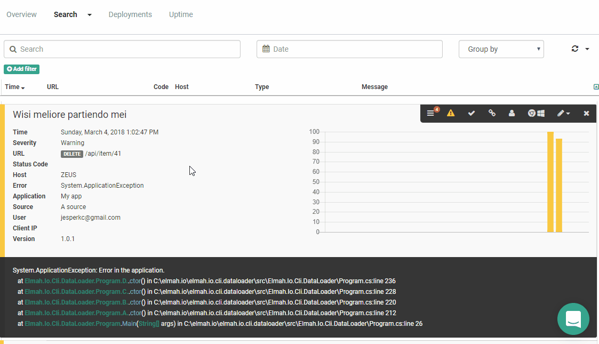

# Search Filters to the Rescue

##### [Thomas Ardal](http://elmah.io/about/), March 7, 2018

Searching your logs has been a key feature since we launched elmah.io. In fact, missing search capabilities in files and ELMAH (the open source project), was the main driver for me to start coding elmah.io back in 2013. elmah.io is built on top of Elasticsearch, which makes full-text search fly at supersonic speed.

While querying for terms has been easy so far, filtering messages hasn't. You can compare a filter with the WHERE part in a SQL statement. Example: I want to find all errors with status code = 500. We've supported this by revealing details about our Elasticsearch mapping, which makes it possible to input queries using Lucene Query Syntax:



The nice thing about Lucene Query Syntax is, that it's very flexible. The downside is that you need to know details about our Elasticsearch mapping like the name, analyzer and other things that you probably don't care much about.

To help digging through your errors, we are launching the first iteration of a new query builder, that we simply call search filters. Search filters are based on simple rules like the example above. The nice thing is, that you can easily add new filters and combine them with other filters. You can even combine filters with full-text queries. Let's see how it works:



In the example, I use filters to find all errors with a status code of 500. Filtering from error details is easy too:



In this example, I want to see all messages with an URL not matching */api/item/41".

Currently, only *Equals* and *Not equal* are supported. Adding new types like *Starts With* and *Contains* will be added in the future.

A quick note about the filters before we round up. You may notice that when filters are added to the UI, it's still formatted using Lucene Query Syntax (like `NOT url:"/api/item/41"`). The *Add filter* dialog is simply an aid to help you write Lucene queries. The nice thing about this is, that you can easily move a search filter to the Search box for greater flexibility, by clicking the *Unlink* icon:



Links on Deployment Tracking, Uptime Monitoring, etc. have been ported to search filters as well.

Let us know what you think.