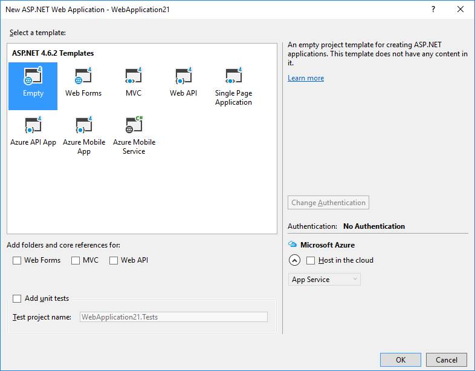
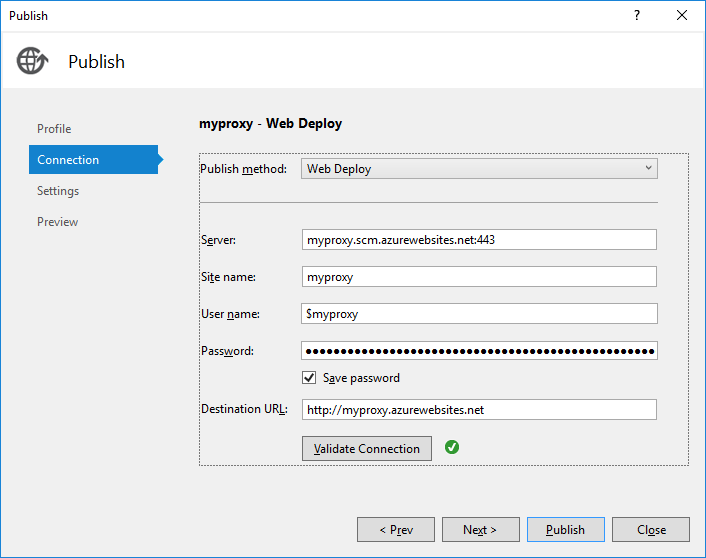

---
description: The ultimate guide to serve a static website hosted on GitHub Pages through SSL and a custom domain. Requires nothing more than an empty Azure website.
image: images/sslgithub_deployproject.png
booksignup: true
---

# Set up SSL on GitHub Pages with custom domain using Azure

##### [Thomas Ardal](http://elmah.io/about/), February 8, 2017

All of the content on this blog, as well as the [elmah.io documentation site](https://docs.elmah.io/), are hosted as static content on GitHub Pages. I needed to add SSL to the URLs, but unfortunately [GitHub Pages doesn't support HTTPS on custom domains](https://help.github.com/articles/securing-your-github-pages-site-with-https/) (no yet at least). A popular choice for adding HTTPS, is to use the free plan on CloudFlare. It requires you to move all of your domains (subdomains + main domain) to CloudFlare, which isn't something that we want to do at this point.

I [asked](https://twitter.com/ThomasArdal/status/817263651119738880) my Twitter followers and got a lot of suggestions. The most simple solution was also the one I ended up using: pushing a website to Azure App Services, acting as a reverse proxy in front of GitHub Pages. A home made CloudFlare, if you will. The idea is described in great detail on the [RuslanY Blog](http://ruslany.net/2014/05/using-azure-web-site-as-a-reverse-proxy/).

To set it up, create a new empty ASP.NET project. I probably could have made this with ASP.NET Core, but for now, it's an old school ASP.NET app. We won't need anything but a simple rewrite rule anyway.



When users browse the new website, I want GitHub Pages to serve the content. For that, I use a simple rewrite rule in `web.config`:

```xml
<system.webServer>
  <rewrite>
    <rules>
      <rule name="Proxy" stopProcessing="true">
        <match url="(.*)" />
        <action type="Rewrite" url="http://elmahio.github.io/blog/{R:1}" />
      </rule>
    </rules>
  </rewrite>
</system.webServer>
```

In the example above, every request to the Azure website, returns the content from the URL `http://elmahio.github.io/blog/{R:1}`. `{R:1}` makes sure that the path on the original request is translated to the page on GitHub. As explained on the RuslanY Blog, we need to enable proxy functionality with Azure. To do so, create a new web app and upload a file named `applicationHost.xdt` to the `site` directory:

```xml
<?xml version="1.0"?>  
<configuration xmlns:xdt="http://schemas.microsoft.com/XML-Document-Transform">  
<system.webServer>  
<proxy xdt:Transform="InsertIfMissing" enabled="true" preserveHostHeader="false"  
reverseRewriteHostInResponseHeaders="false" />  
</system.webServer>  
</configuration>  
```

The easiest way is to use Kudo, but FTP or any Azure file browser should do the trick. That's it for the proxy part. Deploy your website to the new web app on Azure:



I'm using the deployment feature in Visual Studio here, but you probably want to use VSTS, Octopus Deploy, Kudo or similar in production. Once deployed, Visual Studio launches your preferred browser, which now show the content from `http://elmahio.github.io/blog/` when requesting the URL `http://myproxy.azurewebsites.net`. Actually, you have SSL support already, since all websites served by `azurewebsites.net` comes with a SSL certificate. We need to serve the content through a custom domain, so go set that up. I won't go into detail on how to set up custom domains on Azure, since that is already described in [hundreds of blog posts](http://lmgtfy.com/?q=azure+website+custom+domain).

When setup and the DNS records are propagated, I can browse the content on GibHub, using the Azure website as a proxy. It's important here, that you let GitHub serve the content on the default URL (`http://organization.github.io/project/`) and not on a custom domain. This means that any `CNAME` file you may have in your repository and/or `CNAME` DNS records pointing to GitHub Pages must be deleted.

[](https://elmah.io/?utm_source=blogbanner&utm_medium=blog&utm_campaign=blogbanner)

For the final step, I need to set up HTTPS on the Azure web site. Doing that is also [fully documented](https://docs.microsoft.com/en-us/azure/app-service-web/web-sites-configure-ssl-certificate) in the Azure documentation. In the case of the elmah.io blog, I've used this excellent tutorial written by Troy Hunt, to get a free SSL certificate from Let's Encrypt: [Everything you need to know about loading a free Let's Encrypt certificate into an Azure website](https://www.troyhunt.com/everything-you-need-to-know-about-loading-a-free-lets-encrypt-certificate-into-an-azure-website/).

I assume that you are now able to browse your GitHub Pages content through HTTPS on the custom domain. The only thing left, is to redirect requests to the non-SSL version of the domain to one including SSL. Add another rule to `web.config`:

```xml
<rule name="RedirectToHTTPS" stopProcessing="true">
  <match url="(.*)"/>
  <conditions>
    <add input="{HTTPS}" pattern="off" ignoreCase="true"/>
  </conditions>
  <action type="Redirect" url="https://{SERVER_NAME}/{R:1}" redirectType="Permanent"/>
</rule>
```

Once the updated website is deployed, requests are successfully redirected to HTTPS and served from GitHub Pages. For a full example including some extra goodies, we've [open sourced the reverse proxy](https://github.com/elmahio/Elmah.Io.ReverseProxy) running in front of blog.elmah.io and docs.elmah.io.