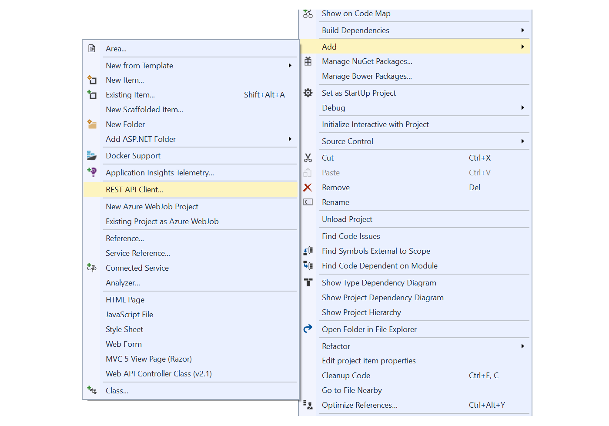

---
description: ...
image: images/rest-api-client.png
---

# Stable v3 API and client integrations

##### [Thomas Ardal](http://elmah.io/about/), October 19, 2017

Today's a good day! We just published new stable versions of all of our client integrations. Almost all of the clients are now running on the [elmah.io v3 API](https://api.elmah.io/swagger/ui/index). API v3 where released in beta more than a year ago. As of last week, the new version moved into stable as well. An [updated overview of our NuGet packages](https://blog.elmah.io/elmah-io-nuget-packages-revisited/) is available to help you get an overview of the clients.

Over the years, we've gained a lot of experiences and feedback from our v2 API. All of the input have been piped into v3, which is available as a [Swagger](https://swagger.io/) endpoint. One of the benefits of moving to Swagger is, that it is now extremely easy to integrate with elmah.io. I don't have a lot of good memories from the days of SOAP and WSDL files, but one thing worked great: the ability to generate strongly typed clients for any programming language using a WSDL file. The same feature is now available using our Swagger endpoint and a client generator like AutoRest (built into VS2017):



Actually you don't even need to generate a client yourself. Our [Elmah.Io.Client](https://www.nuget.org/packages/elmah.io.client/) package has been updated to use the new API. Most parts of the client is auto-generated using AutoRest as well.

## What changed?

Here are the highlights of the new API:

- API keys introduced to improve security (more about this later)
- Available as a Swagger endpoint.
- New endpoints for creating and fetching logs.
- New endpoints for creating and fetching deployments.
- Request throttling to make sure that you don't use up all of your included messages within a few minutes.
- API available on `https://api.elmah.io` (rather than `https://elmah.io/api`), which makes it possible for us to scale and modify the API without touching the website.

The message endpoints used to log messages to elmah.io looks almost identical to v2.

## How to upgrade?

The big change when moving to API v3 is the introduction of [API keys](https://blog.elmah.io/five-advantages-by-moving-your-subscription/#multiple-api-keys). In API v2, anyone with a log ID (the GUID representing your log), would be able to extract content from that log. With API keys, you now have the option to generate API keys for different clients, revoke a key if you suspect that it has been compromised and more.

When upgrading your elmah.io.* client packages, you will need to add your API key to your configuration ([Where is my API key](https://docs.elmah.io/where-is-my-api-key/)). How the API key should be added, depends on your integration. With ASP.NET Core, you will see a compile errors after upgrade, since Elmah.Io.AspNetCore and Elmah.Io.Extensions.Logging are configured through code. When upgrading the Elmah.Io package (ASP.NET / MVC / Web API), you will need to add the new `apiKey` attribute to your `web.config`:

```xml
<elmah>
    <errorLog type="Elmah.Io.ErrorLog, Elmah.Io" apiKey="API_KEY" logId="LOG_ID" />
</elmah>
```

If you are dependant of someone allowing outbound traffic from your webservers, you will need to ask for access to `https://api.elmah.io` when upgrading to v3.

For more info on installing the different client integrations, check the installation guides on [https://docs.elmah.io/](https://docs.elmah.io/). The documentation will also help you upgrade the parts of the update that isn't backwards compatible. If you have a question, please don't hesitate to reach out to our support.