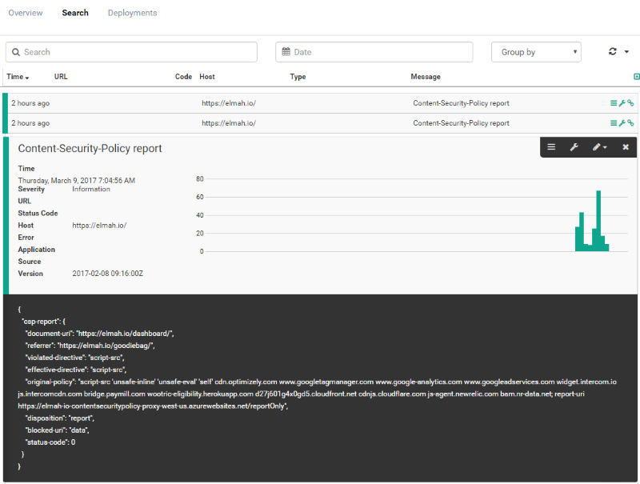

---
description: Utilize elmah.io to store actual Content-Security-Policy errors happening in your users browsers. We've developed a simple proxy to make it easy.
image: images/content-security-policy-results.png
booksignup: true
---

# Storing Content-Security-Policy reports in elmah.io

##### [Thomas Ardal](http://elmah.io/about/), March 14, 2017

In the previous post, [Content-Security-Policy in ASP.NET MVC](https://blog.elmah.io/content-security-policy-in-asp-net-mvc/), I showed you how to implement the `Content-Security-Policy` header. This header is among the more difficult to implement, since you need an overview of all of the dependencies of your web app. I also mentioned the `Content-Security-Policy-Report-Only` header, which will show you the blocked resources, but carry on the execution like nothing happened.

While the `Content-Security-Policy-Report-Only` header is great, you probably want to run with that in production before actually switching to `Content-Security-Policy`. Having real users testing your system with the report header included, is the ultimate test really. The problem here is, that Chrome (and other browsers) as default reports any problems to the console. Since you cannot see each users console, you will need to intercept problems happening in another way.

Say hello to `report-uri`. `report-uri` is a mechanism built into `Content-Security-Policy`, that lets you send all errors, otherwise only shown in the console, to an URL of your choice. While you can develop a REST API that receives these errors, why not use elmah.io? We have developed a simple proxy that does nothing more than receive Content-Security-Policy reports and log them in an elmah.io of your choice. The project is located on GitHub here: [Elmah.Io.ContentSecurityPolicy.Proxy](https://github.com/elmahio/Elmah.Io.ContentSecurityPolicy.Proxy).

To set up the proxy, clone the repository and change `API_KEY` and `LOG_ID` in `appsettings.json`. `API_KEY` should match a key found beneath your organization settings and `LOG_ID` should be the ID of the log you want to include the reports. Once changed, deploy the service to an IIS, Azure or similar. The proxy is built in ASP.NET Core and therefore deployable pretty much everywhere.

To use the proxy from your web app, add a `report-uri` to the `Content-Security-Policy-Report-Only` header:

```xml
<add
  name="Content-Security-Policy-Report-Only"
  value="default-src 'self'; report-uri https://cspreports.azurewebsites.net/reportOnly" />
```

That's it folks. Reports are now automatically sent to elmah.io:

