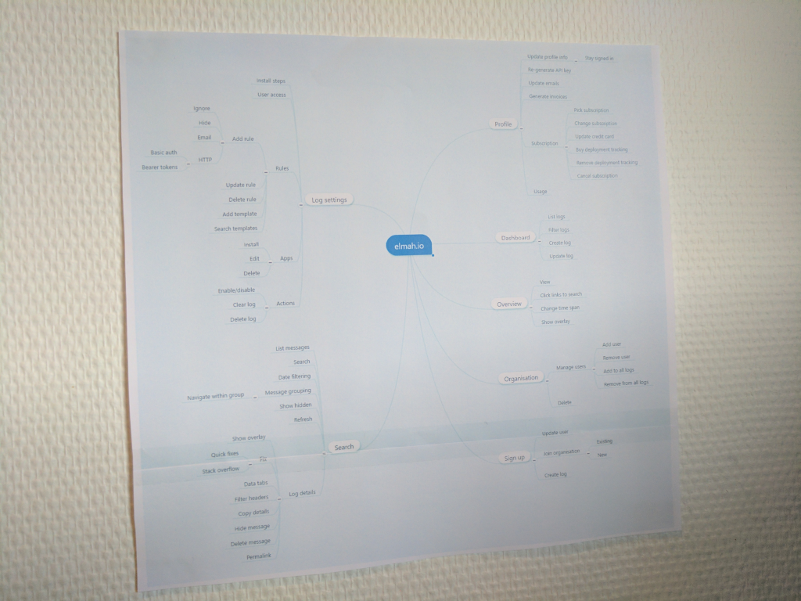

# Testing software is hard

##### [Thomas Ardal](http://elmah.io/about/), December 8, 2016

Testing software is hard. If you don't have the same feeling, you are either better at it than me or maybe you are doing something wrong. I've been doing professional software development for 15 years and coded before that pretty much since I got my first Commodore 64. I don't find coding that hard and with modern tools like Visual Studio and ReSharper, getting lines of code in source control is pretty much a walk in the park. Creating bug free software (doesn't exist) is freaking hard.

If you are already familiar with our [technology stack](elmah-io-technology-stack.md) and challenges in [building a scalable architecture](Building-a-salable-architecture-to-handle-millions-of-errors.md), you know that elmah.io consists of many moving parts. Everything needs to work and as the system is growing, we are moving towards a microservice-based architecture, creating even more integration points that can potentially stop working. While we use different technical solutions and frameworks to support this, this post will focus on how we divide and conquer our testing activities.

When developing elmah.io, we focus on three different types of tests: unit tests, integration tests and system tests. It's a pretty old school test approach, but the best we have found so far.

Unit tests are written with [NUnit](https://www.nunit.org/), [Moq](https://github.com/Moq/moq4) and [AutoFixture](https://github.com/AutoFixture/AutoFixture). There are other libraries out there, doing things a bit differently. We like the combination of these tools, since all of them are very well documented, supported by the community and integrated into Visual Studio, AppVeyor etc. We try to unit test all complex code, meaning that we in no way aim for 100 % code coverage from our unit tests. In fact we don't have a target, since we have bad experience measuring on code coverage metrics. Developers are layzy (yes we are!), why aiming for 80 % code coverage or similar, makes people (me included) write tests of lines of code rather than critical code.

Unit tests typically looks like this:

```csharp
[TestCase(false, "00000000-0000-0000-0000-000000000000")]
[TestCase(false, "hest")]
[TestCase(false, null)]
[TestCase(false, "")]
[TestCase(true, "22c7a1e9-bcfc-4714-8a7a-1b241208a832")]
public void CanCheckLogId(bool shouldBeValid, string guidToCheck)
{
    Assert.That(guidToCheck.IsLogId(), Is.EqualTo(shouldBeValid));
}
```

For integration tests, we use NUnit and AutoFixture as well. In integration tests, we test code like communication between microservices, queries against the database and similar. I often hear people say that one of the advantages with a microservice architecture is, that you only need to test that each service works on its own. In my experience, this approach simply doesn't guarantee that the integration between services work. With that said, having code split up into different [bounded contexts](http://martinfowler.com/bliki/BoundedContext.html) and testing these separately, makes a whole lot of sense.

Integration tests could look like this:

```csharp
[Test]
public void CanGetAllLogs()
{
    // Arrange
    var organisation = CreateOrganisation(userId);
    var log1 = CreateLog(fixture.Create<string>(), organisation.Id);
    var log2 = CreateLog(fixture.Create<string>(), organisation.Id);
    this.CreateUser(userId, log1.Id, log2.Id);
    elasticClient.Flush(f => f.Index(index));

    // Act
    var logs = elmahLogsController.All();

    // Assert
    Assert.That(logs.Logs.Count(), Is.EqualTo(2));
    Assert.That(logs.Organisations.Count, Is.EqualTo(1));
    Assert.That(logs.Organisations.First().Logs.Count, Is.EqualTo(2));
}

```

System tests involves spinning up the entire system and clicking buttons inside the UI or calling endpoints in the API. These are by far the most expensive tests to run and we try not to test everything through the UI each time we change something. We use mindmaps to help identify all of the features we have and what should be tested:



This is an actual photo of a mindmap hanging at my desk as of writing this post. We have found that splitting features into branches on a mindmap, helps us identifying which areas of the software that we should test. Change something in the user profile => go to the Profile branch and assess which flows to test.

People sometimes ask us, if we have automated UI tests. When we tell them that we don't, the next question is always "why not?". I have seen automated UI tests providing value, but maintaining the tests have always required a full time position for at least one guy (or gal). I believe that I have some experience in this area. Throughout the years, I have worked with a lot of frameworks, promising smooth development of UI tests like Silk test, Selenium, NBehave, SpecFlow, Ranorex and more. They are all good tools, but require a massive effort to keep running. Since we are a small startup, we have decided to perform system tests manually for now, but things could definitely change in the future.

Besides that time saved executing manual tests, another advantage of automated UI tests, would be the option of testing more browsers, versions and operating systems (using something like [Selenium grid](https://github.com/SeleniumHQ/selenium/wiki/Grid2)). We are currently testing elmah.io on the newest stable version of Chrome, Firefox, Internet Explorer and Edge. Our users primarily use Chrome, why having a kick ass system on that browser is priority one. But with .NET Core, we see a switch for some of our users to Linux and Mac, why Safari/Chrome/Firefox on Mac and Chrome/Firefox on Linux are getting more important by the day.