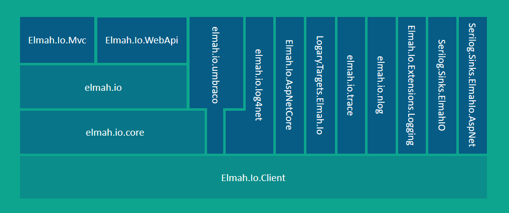

---
description: An overview of the elmah.io client library NuGet packages. Which web- and logging-frameworks do we support and how are dependencies between packages.
image: images/nuget_packages.png
---

# The elmah.io NuGet package landscape

##### [Thomas Ardal](http://elmah.io/about/), January 31, 2017

> A more recent version of this overview is available here: [elmah.io NuGet packages revisited](https://blog.elmah.io/elmah-io-nuget-packages-revisited/)

We are in the process of building prereleases of all of the elmah.io client integrations. While doing so, it has come to my attention, that a good overview of all of the packages doesn't really exist. Let's start by looking at a diagram showing all of the elmah.io NuGet packages and their dependencies:



From the bottom up:

### [Elmah.Io.Client](https://github.com/elmahio/Elmah.Io.Client)

Every messages logged on elmah.io goes through our [API](https://api.elmah.io/swagger/ui/index). `Elmah.Io.Client` is a partially auto-generated package for talking with the API. Besides a 1:1 mapping of the API, `Elmah.Io.Client` also contains a logging API known from logging frameworks like Serilog and log4net. The logging API allows for logging everything from Verbose to Fatal messages.

As illustrated on the diagram, all other client integrations uses `Elmah.Io.Client` to talk to the API. If you want to create an integration for elmah.io, this is the package to depend.

### [elmah.io.core](https://github.com/elmahio/elmah.io)

The `elmah.io.core` package, contains our integration for ELMAH. If you want to add logging of all uncaught errors in your ASP.NET (classic, MVC and Web API) application, this is your package of choice.

### [elmah.io](https://github.com/elmahio/elmah.io)

While `elmah.io.core` contains the actual implementation for ELMAH, `elmah.io` is a convenience package. No code is included in this package but in real life, you will start by installing this package anyway. The package contains config transformations, as well our PowerShell installer (the dialog you see when installing, asking for your log ID). Once installed, you can safely remove this package, leaving `elmah.io.core` and `Elmah.Io.Client` as the packages handling everything.

### [Elmah.Io.Mvc](https://www.nuget.org/packages/Elmah.Io.Mvc/)

Much like the `elmah.io` package, `Elmah.Io.Mvc` act as an easy installer when using elmah.io from ASP.NET MVC.

### [Elmah.Io.WebApi](https://www.nuget.org/packages/Elmah.Io.WebApi/)

Same story as `Elmah.Io.Mvc` just for ASP.NET Web API.

### [elmah.io.umbraco](https://github.com/elmahio/elmah.io.umbraco)

We love Umbraco and believe it's the best .NET CMS out there. Our native support for Umbraco, contains everything needed to log uncaught exceptions (by depending `elmah.io.core`), as well as hooking into Umbraco's own logging feature (using `elmah.io.log4net`).

### [Elmah.Io.Extensions.Logging](https://github.com/elmahio/Elmah.Io.Extensions.Logging)

When releasing ASP.NET Core, Microsoft also made a new logging framework available called Microsoft.Extensions.Logging. As sexy as that name sounds (?), it's a good logging framework, inspired by similar community driven projects. In fact, Microsoft.Extensions.Logging can act as a simple proxy for other logging frameworks and that it exactly how you'd use it with elmah.io. Using the `Elmah.Io.Extensions.Logging` package, you can send everything from Verbose to Fatal log statements from any .NET Core application to elmah.io.

### [Elmah.Io.AspNetCore](https://github.com/elmahio/Elmah.Io.AspNetCore)

`Elmah.Io.AspNetCore` is out implementation for ASP.NET Core. Using middleware, all uncaught exceptions in your ASP.NET Core application, are send to elmah.io. If ELMAH is ever ported to ASP.NET Core, we may discontinue this package. For now, this is the package for integrating ASP.NET Core with elmah.io.

### [Logary.Targets.Elmah.Io](https://github.com/elmahio/logary)

Logary is a logging framework for .NET, written entirely in F#. Our integration for Logary, makes it possible to log different types of messages in elmah.io, through Logary.

### [elmah.io.trace](https://github.com/elmahio/Elmah.Io.Trace)

A simple .NET trace listener, sending trace messages from the `Trace` class in .NET to elmah.io.

### [elmah.io.nlog](https://github.com/elmahio/elmah.io.nlog)

Log target for the popular .NET logging framework NLog.

### [elmah.io.log4net](https://github.com/elmahio/elmah.io.log4net)

Appender for the oldest .NET logging framework on the block: log4net. While log4net may not be the new shiny thing, it's still the most commonly used logging framework. We have excellent support for log4net.

### [Serilog.Sinks.ElmahIO](https://github.com/serilog/serilog-sinks-elmahio)

Serilog is a very popular logging framework, that has gained a lot of traction and attention during the last years. We use Serilog ourselves, to log messages from all of the components inside elmah.io. Using this package, logging error messages (as well as debug, information etc.) through Serilog, is easy as 1-2-3.

### [Serilog.Sinks.ElmahIo.AspNet](https://github.com/serilog/serilog-sinks-elmahio)

While `Serilog.Sinks.ElmahIO` is a great choice for most logging needs, you may want additional information stored, when logging from a web application. The `Serilog.Sinks.ElmahIo.AspNet` package, logs a lot of information from the HTTP context as well, when logging messages through Serilog. If you are using Serilog from a web application, this package is the better choice.