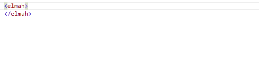

# The ELMAH Schema

##### [Thomas Ardal](http://elmah.io/about/), March 11, 2016

> Disclamer: Configuring ELMAH (as well as elmah.io) happens through your application configuration file (like web.config). In the next version of ASP.NET, web.config files are removed, but web.config files will probably continue to exist for years to come.

Both ELMAH and elmah.io automatically adds configuration to web.config during installation of the NuGet package, but you may want to edit the ELMAH configuration from time to time. Since Visual Studio doesn't provide IntelliSense for non-Microsoft configuration, you will need to look in the ELMAH documentation when needing to configure ELMAH.

We are happy to report that we've taken ownership of the ELMAH Configuration XML Schema. Drop the XML Schema anywhere in your project and add a namespace to your `elmah` element:

```xml
<elmah xmlns="http://Elmah.Configuration">
</elmah>
```

That's it! Start adding some config:





