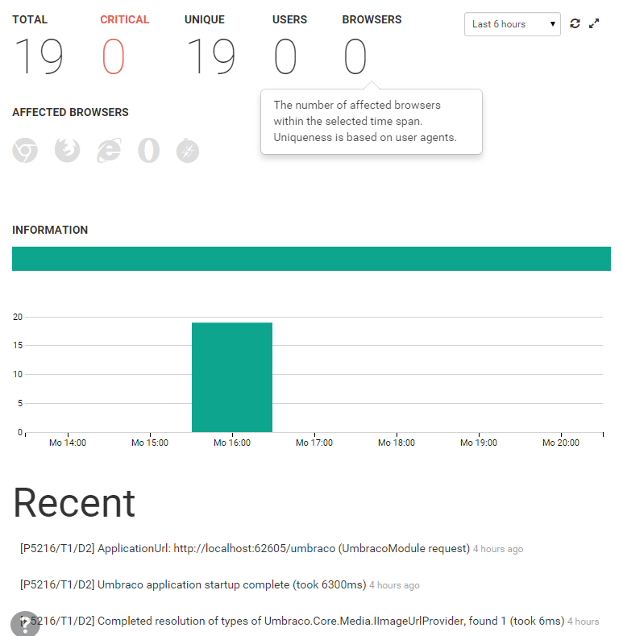

# Umbraco and elmah.io are new best friends

##### [Thomas Ardal](http://elmah.io/about/), August 3, 2015 in [Tutorials](/category/tutorials/)

elmah.io want to support every major web and app framework for .NET. In this post I will show you how to log data from Umbraco CMS into your elmah.io log, using a recent addition to the family of integrations.

Since Umbraco itself is written in ASP.NET, ELMAH works like a dream inside Umbraco. Besides logging uncaught errors, elmah.io also supports other types of messages like information and debug. In fact all of the log levels that you already know from log4net, NLog and Serilog, are supported on elmah.io as well. Logging in Umbraco CMS is based on log4net, which elmah.io also support. We have brought all these pieces together into a NuGet package that we call: [elmah.io.umbraco](https://www.nuget.org/packages/elmah.io.umbraco/).

To start utilizing elmah.io from your Umbraco site, all you need to do is install the elmah.io.umbraco package:

```powershell
Install-Package elmah.io.umbraco
```

Hit F5 and watch messages start flowing into elmah.io:



Like the [elmah.io](https://www.nuget.org/packages/elmah.io/) package, the install process asks you for your log id and everything is setup automatically. Installing the elmah.io.umbraco package modifies your website in three ways:

1. Installs ELMAH to log uncatch errors on your site.
2. Modifies your log4net configuration to log messages through log4net in elmah.io.
3. Installs an ApplicationEventHandler into Umbraco, logging 404’s.
