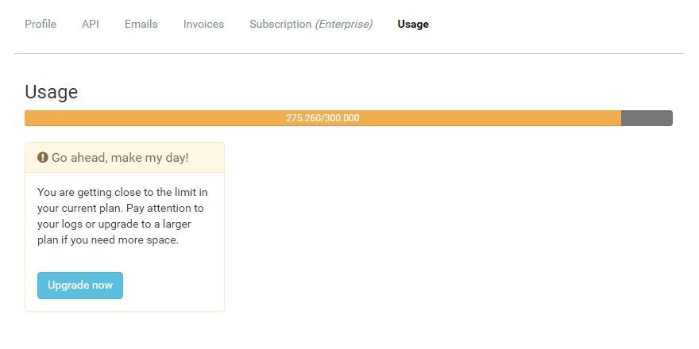

# Usage Monitoring

##### [Thomas Ardal](http://elmah.io/about/), August 29, 2016

Like any other service out there, we cannot offer unlimited storage. That's why we've set a limit on logged messages per plan. Like 25.000 messages per month when on the Business plan. For more details, check out the [plans and pricing](https://elmah.io/pricing) page.

The message limits have always been soft limits, meaning that we don't stop logging if the limit is exceeded. With that said, we often ended up stopping the flow of messages for certain logs anyway. Imagine when one of our users website suddenly start logging millions and millions of unique errors. A lot of data to process, right? This means that if you burst through your message limit, we cannot guarantee that we will continue to log your messages.

To help you keep track on how many messages you are currently storing, we recently introduced a new Usage tab beneath your profile:



The progress bar show how many messages you have currently logged. When getting near the limit, you will get a warning like shown on the screenshot above. When bursting through the limit, you will see another message. Also if bursting through, we will send you an email to remind you to clear your logs or upgrade to a larger plan.

We hope that the Usage tab, as well as the new email, will help you keep an eye on your log sizes.