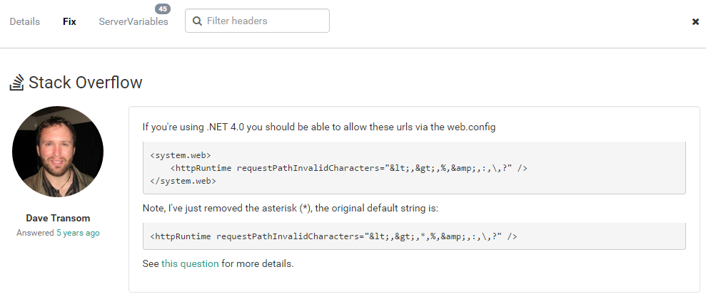

# We don't just log your errors. We help you fix them!

##### [Thomas Ardal](http://elmah.io/about/), October 11, 2016

You may have noticed that we refer to ourselves as _Error Management_ and not _Error Logging_. So what is the difference? _Error Logging_ is the process of catching errors and logging them for further inspection. Most SaaS products out there, saying they do _Error Management_ actually only does _Error Logging_. _Error Management_ is so much more than just logging errors. Being able to [notify you on Slack when critical errors occur](http://docs.elmah.io/elmah-io-apps-slack/) or [grouping errors to get a better overview of your current errors](/improved-message-grouping) are just two examples on what will make up a good _Error Management_ tool.

At elmah.io we have just begun an exciting new chapter. We still don't just want to log your errors. We want to help you fix them. To help you even further to do so, we've started working on a new tab on error details, simply  named _Fix_. We have much planned for the _Fix_ tab, but today we introduce step 1. Take a look at the new tab:



The _Fix_ tab shows what we believe is the most relevant Stack Overflow answer of the current error. If you use Stack Overflow (who doesn't?), you know that the accepted answer of a question, is not always the best one. That's why we have developed an algorithm, that finds the single best answer across multiple questions related to the current error. While we still tweak the algorithm, we are at a place right now, where we are pretty happy with the results.

So what's next? We don't want the _Fix_ tab to be about Stack Overflow only. We are currently working on step 2 of the _Fix_ tab, which will give you even better tools to help fix an error. Stay tuned at the blog for more details soon.