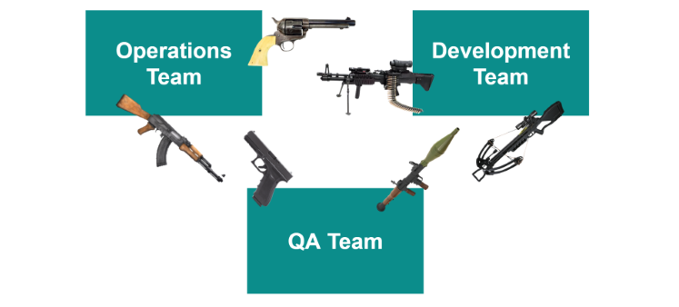
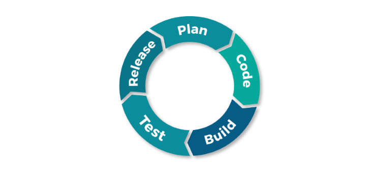
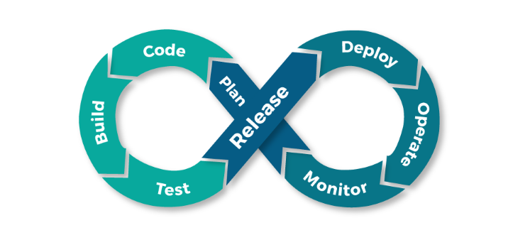

# What is DevOps - A development process or a set of tools

##### [Thomas Ardal](http://elmah.io/about/), June 16, 2017
 
 Before we begin, I want to ask you a question. Do you have a clear definition of what [DevOps](https://elmah.io/devops) is or is that really why you came here? I can understand if you're confused. The term DevOps is probably the biggest buzzword of this decade. If you google “what is DevOps,” you get around 8,8 million results. And if you go through each result, you’d probably end up with 8,7 million different definitions. Among the different results, you will find job postings for "DevOps Engineers", tools claiming to implement DevOps in your organization and much more. Within this article, I will tell you why all of this is wrong.

Let's start with a definition. Ernest Mueller from [The Agile Admin](https://theagileadmin.com/) wrote this nice and short explanation: 

> DevOps is the practice of operations and development engineers participating together in the entire service lifecycle, from design through the development process to production support.
> 
> &mdash; *Ernest Mueller, The Agile Admin*

So basically, DevOps tells us to make our developers and operations people work together. In order to understand why we would want to do that, let's look at a bit of history.

Most software projects have a set of roles defined. Depending on what you are doing and the size of your team, one or more roles may be shared by single persons. However, all software projects need:

1. Developers
2. Testers
3. Operations

Let's look at each role in isolation:

**Developers**

In charge of building new software features. Developers love building complex things. Sometimes the solutions produced by developers are extremely complex just for the fun of it (of course you don't find it fun, but I guess you know someone who does :)). In order to build new features, developers constantly need to change things. Most developers hate testing and when other people break their code even more. Finally, developers never compromise. Having beautiful and maintainable code is the most important thing to these guys.

**Testers**

Next up is the testers. They are responsible for making sure new features actually work and that developers didn't break existing features. Testers love breaking stuff. Basically, these guys get up every morning to find bugs in other people’s code. Like developers, testers don't like compromises. Having working features is most important thing in the world.

**Operations**

Finally, we have the operations people. Operations are responsible for deploying new features to production, maintaining the infrastructure, monitoring errors and performance, etc. Unlike developers, operations folks don’t like change. Their whole purpose is to keep things stable and in the end, these are the ones having to work during weekends when the software breaks down. Operations people never compromise. Having a stable environment is the most important thing to them.

See the problem here?

Three different roles with three different agendas, needing to work together towards a common goal. It’s certainly a deadly cocktail. 10 years ago, we starting fixing some of these problems (as well as a lot of other problems with waterfall) by introducing agile processes like Scrum and Kanban. With agile, you build software in small iterations and all the product people, developers and testers are forced to work together, to produce a constant flow of software releases.

Working in small iterations is probably the right solution for pretty much every software project. One thing that most of us forgot when implementing agile was the operations people. While we were suddenly able to produce a constant flow of well-tested releases, we still had the operations people outside of this feature life cycle loop. Understandably, the operations guys started complaining. We just went from producing a new version every 6 month to producing maybe multiple releases per day, and we just counted on the operations people to handle this. Back in the day, most projects deployed new releases manually or using some simple scripts not really geared towards continuous delivery.

With DevOps, we include the operations guys into the development cycle and finally, everyone is working towards the same goal: releasing working features to production, while ensuring that our production environment is working and actions are taken when it’s not. It took around 50 years to reach this goal, but we finally seem to be there with DevOps.

Compared to a waterfall process, agile introduced a whole range of new tools, which are needed to keep quality releases flowing. When throwing the operations part into the mix, existing tools get as relevant as ever and new and smarter automation tools are required as well. Tools like Git, GitHub, TeamCity and similar, have changed the way we build software today. New tools like Octopus Deploy, Visual Studio Team Services, NuGet, Azure, Docker and more are yet again changing the way we work as we speak.

To answer the question in the title, DevOps is a new and improved way of working. From this day on, you might even think of it as Agile 2.0. When multiple roles with different agendas and requirements need to work together around releasing working software, new processes and tools are necessary. To implement DevOps in your organization, you will need to think about the following:

* People need to communicate and work together.
* Having cross-function teams is the best way to make people work together towards a common goal.
* No single tool will implement DevOps for you. Rather, picking the right tools that fit each phase in DevOps as well as in your organization will.