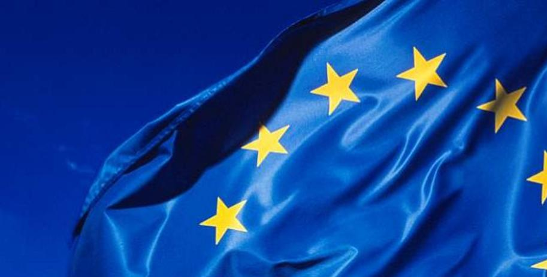

# Working towards GDPR compliance

##### [Thomas Ardal](http://elmah.io/about/), January ?, 2018

You may have heard about [GDPR](https://www.eugdpr.org/) or the General Data Protection Regulation. It's a new law that every company dealing with EU citizens needs to follow. We are working with an external law firm to make sure that we comply with the new set of rules and guidelines.



We are currently looking at the last technical issues and started documenting a range of things as well. As usual, we want to be 100% transparent. You can follow the work and get under the elmah.io hood on our new [GDPR Wiki](https://github.com/elmahio/GDPR/wiki). Documentation is added as we write it or in some cases, move it from our internal wiki. Also make sure to follow the [elmah.io Security](https://elmah.io/security/) page for details. We are planning a redesign of this page as well as extended information about GDPR.

Feel free to reach out if you have any questions regarding GDPR, security or our procedures for handling your data.