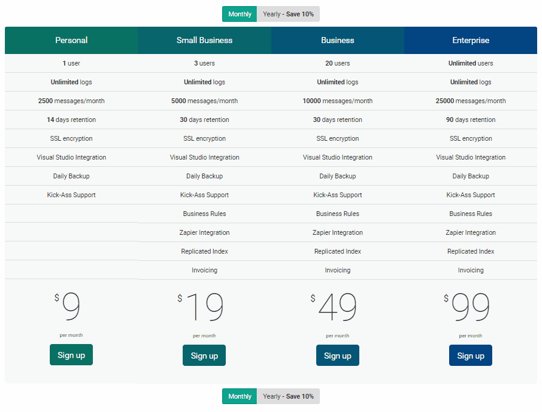

# Yearly Subscriptions

##### [Thomas Ardal](http://elmah.io/about/), December 1, 2015

Your wish is our command. Well almost. A recurring feature request have been yearly payments, known from similar SaaS applications. As of today, you will be able to choose to pay one year in advance on any elmah.io plan:



Having customers willing to pay yearly (rather than monthly) is something that we are extremely proud of. That kind of commitment tells us that our customers love the product. To show you some reverse love and to thank you for the commitment, we offer a **10 % discount** on all yearly subscriptions.

As usual, please wait until your current subscription expires, before making adjustments to the plan and payment cycle. We cannot offer you a refund if switching plans during the month/year.

